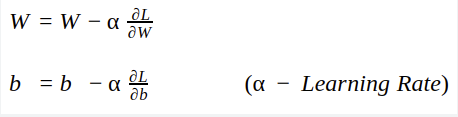

## Multi-layered Perceptron Model (Artifical Neural Network)

here we will consider two layer neural network, as we know the input layer can't be considered as any layer so we will have one hidden layer and one output layer so this will became two layer neural network as shown below

## The process inside the first hidden layer of neurons

There we perform two steps in the hidden layer

- step1: Multiply the input values with the weights assigned to them and add bias to the equation.

z = x1w1 + x2w2 + ... + xnwn + 1*w0
z = sum (xiwi + w0)

- step2: Apply activation function on top of the Z value. As we are learning about the binary classification problem so we will apply sigmoid activation function here.

Whatever will be the output of activation function we can call it as output of hidden layer and this output is passed to output layer as input

## The process inside the second hidden layer of neurons or Output layer

Again in this layer also we will perform the same above two steps:

- step1:
We will assign again some weight and add bias to this layer neurons.
The input to this layer neuron is output of previous layer neurons.

- step2:
Apply activation function on top of the above z value from step1.
Here we will apply same sigmoid activation function as we have to transform z value to 0 - 1.

Now whatever will be the output of this layer neuron, will be the output of our neural network.

## Loss

Now whatever will be the difference between the actual value and the predicted output by the neural network, will be the loss.

loss = (y - y^)

Now to reduce this loss value we will perform the backward propogation and update all the wights from backward side.

## Backward propogation & Weight updation formula

Weight updation formula is given as,

W(new) = W(old) - learning rate * del(loss)/del(W(old))

The same above formula also works for the bias as we update bias also.

With the help of the above formula we will update weights from backward i.e. the last weight & bias for last neuron will update first and the weights & bias for input layer will update in last.

This is called as backpropogation.

This weight updation is done by the **Optimizers** in Neural networks.

## Chain Rule of Derivative

As we use two layer neural network, let's suppose the weight for last neuron of output layer is w4

w4 new = w4 old - learning rate * del (loss) / del (w4 old)

del (loss) / del (w4 old) this term is slope of the point.

Now del (loss) / del (w4 old) this directly can't get calculated as we cannot find derivative of loss with respect to w4.

Hence we need to use Chain rule here,

del (loss) / del (w4 old) = del (loss)/del(O2) * del(O2)/ del (w4 old)

Here O2 is output of output layer neuron, as loss is dependent on this output. This O2 output of output layer neuron is dependent on the weight assigned to that neuron which is w4.

Hence this becomes a chain rule,
del (loss) / del (w4 old) = del (loss)/del(O2) * del(O2)/ del (w4 old)

## Vanishing Gradient Problem 

As in the hidden layer neurons, we use activation function on top of Z. 
And we also have seen that, we can use sigmoid function as a activation function.

The value ranges for sigmoid activation function

0 < sigmoid > 1

But in the backpropogation we find out derivatives, so the derivative of sigmoid ranges from

0 < sigmoid derivative > 0.25

In the chain rule the derivative of sigmoid activation function ranges from 0 - 0.25

Now anything multiplyed with [0 - 0.25] such a small number we will get smaller number only.

So the w(new) is approx equal to w(old) not any significant difference will be there.

Hence the convergence to gloabl minima would not be possible or new weights will not get updated that much.

This problem is called as Vanishing Gradient Problem
hence in deep layer neural network, the sigmoid activation function will not work in hidden layers.

To resolve this issue we use other activation functions like Tanh, ReLu, Leaky ReLu etc.

