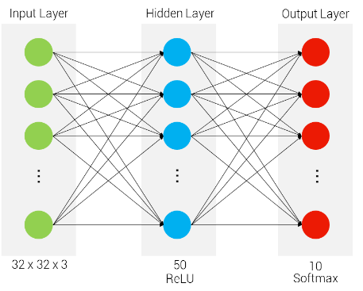
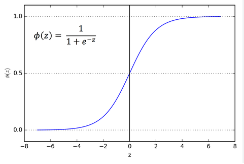

## Multi-layered Perceptron Model (Artifical Neural Network)

here we will consider two layer neural network, as we know the input layer can't be considered as any layer so we will have one hidden layer and one output layer so this will became two layer neural network as shown below

## The process inside the first hidden layer of neurons

There we perform two steps in the hidden layer

- step1: Multiply the input values with the weights assigned to them and add bias to the equation.

z = x1w1 + x2w2 + ... + xnwn + 1*w0
z = sum (xiwi + w0)

- step2: Apply activation function on top of the Z value. As we are learning about the binary classification problem so we will apply sigmoid activation function here.

Whatever will be the output of activation function we can call it as output of hidden layer and this output is passed to output layer as input

## The process inside the second hidden layer of neurons or Output layer

Again in this layer also we will perform the same above two steps:

- step1:
We will assign again some weight and add bias to this layer neurons.
The input to this layer neuron is output of previous layer neurons.

-step2:
Apply activation function on top of the above z value from step1.
Here we will apply same sigmoid activation function as we have to transform z value to 0 - 1.

Now whatever will be the output of this layer neuron, will be the output of our neural network.

## Loss

Now whatever will be the difference between the actual value and the predicted output by the neural network, will be the loss.

loss = (y - y^)

Now to reduce this loss value we will perform the backward propogation and update all the wights from backward side.

## Activation Functions:

1) Sigmoid Activation Function:

The main aim of sigmoid activation function is to convert any value of z to 0 to 1.

