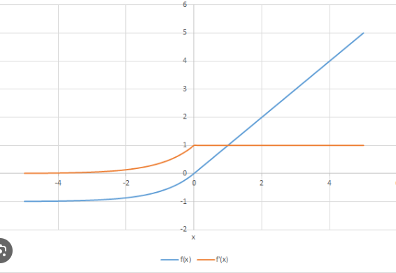

## Activation Functions

1) Sigmoid:

**Advantages:**
- Clear prediction either 1 or 0.

**Disadvantages:**
- Prone to vanishing gradient problem
- Function output is not zero centered

Not zero centered output means the function is line not passing through zero.
It does not smoothen the weight updation as the weights get scattered before converging a lot as shown below.

2) TanH:

The tanH function is given as,

The derivative of tanH function is given as,

**Advantages:**
- Zero centered function as the line is passing through zero

**Disadvantages:**
- Time complexity increases
- vanishing gardient problem for deep layer neural network

3) ReLu:

The activation function is given as,

The derivative of RelU is given as,

The derivative of ReLu is either 0 or 1, so whenever the derivative is 0 there will be problem called **Dead neuron**

**Advantages:**
- Time complexity is much less

**Disadvantages:**
- Not zero centered
- Dead neuron probelm

4) Leaky ReLu or Parametric ReLu:

The Leaky ReLu activation function is given as,

In this we multiply with 0.01 so derivative never becomes 0.

The derivative of this function is given as,

But in parametric ReLu we multiply with alpha which is hyperparameter.

**Advantages:**
- Prevents the dead neuron problem as we multiply with 0.01 so derivative never becomes 0

**Disadvantages:**
- Not zero centered takes time to reach global minima

5) Exponential Linear Unit (ELU):

The activation function is given as,

The derivative is given as,

**Advantages:**
- Prevents the dead neuron problem.

**Disadvantages:**
- Time complexity increases as the equation is complex

## Now to solve the binary classification problem we can use sigmoid activation function in output layer
## But what can be used if we have multiclass classification problem

Then for that we can use Softmax activation function

6) Softmax Activation function:

The formula for softmax activation is given as above.
Now suppose we have 3 classes to predict. Here we can't use sigmoid activation function. It can predict more than one class above the threshold value and we cannot predict more than 1 class as the output for one row.

Now as shown above let's suppose that we have 3 output classes, we apply softmax function to each output neuron.
After applying softmax function we will get,

Now whichever class has the highest probability that class will be the output for that record.

## Which activation function we use when?

- In hidden layers we can use Relu and its variants.
- In output layer and if we have binary classification we can use sigmoid activation function.
- In output layer and if we have multiclass classification we can use softmax activation function.
