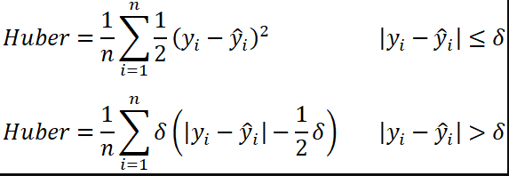
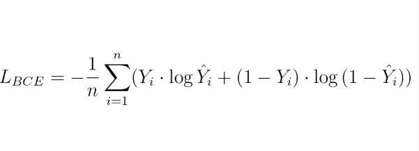
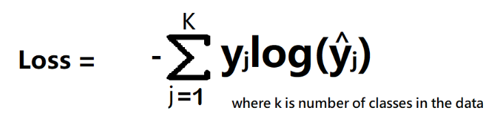

## Loss Function

A loss function is a mathematical function that quantifies the difference between predicted and actual values in a machine learning model. It measures the model’s performance and guides the optimization process by providing feedback on how well it fits the data

### Loss functions for regression problems

Loss function is used for single datapoint
wherein Cost function is used for bulk data points

1) Mean Squared Error (MSE): 

The formula for MSE is given as

Loss function = (y - y^)^2

Cost Function = 1/n sum((yi - yi^)^2)

The equation for MSE loss function is a quadratic equation and the graph for quadratic equation is parabola.

The gradient descent curve is also a parabola curve, hence it has only one gloabal minima point.

**Advantages:**

1) MSE is differentiable
2) It has one global minima
3) It converges faster

**Disadvantages:**
1) Not robust to outliers

2) Mean Absolute Error (MAE):

Loss function = |y - y^|

Cost Function = 1/n sum(|y - y^|)

**Advantages:**

1) robust to outliers

**Disadvantages:**
1) Convergence is slow

3) Huber Loss:
This is the combination of MSE & MAE

### Loss functions for classification problems

We have a technique in classfication called **Cross-Entropy**

There are three types of Cross-Entropy:
1)  Binary Cross Entropy (Binary)
2) Categorical Cross Entropy (Multiclass)
3) Sparse Categorical Cross Entropy (Multiclass)

1)  Binary Cross Entropy (Binary):

Loss function is given as,

Also this is the log loss formula in logistic regression, where y^ = sigmoid function 1/1+e^-z

2) Categorical Cross Entropy (Multiclass):

The loss function is given as,

3) Sparse Categorical Cross Entropy (Multiclass):

All the formula and finding of the probabilities of classes is same as the above.
It's just take the class whichever class has the hight probability defined by the Softmax activation function as output.