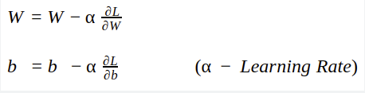
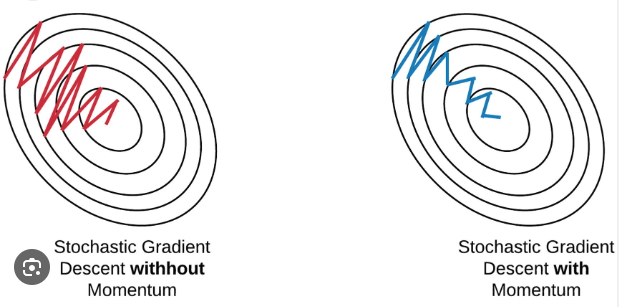

## Optimiers

optimizers are algorithms that adjust the model’s parameters during training to minimize a loss function. They enable neural networks to learn from data by iteratively updating weights and biases.

1) Gradient Descent Optimizer:

The optimizer is used to update the weights and bias to back propogate in the neural network.
We use the below formula to update the weights

The gradient descent curve will looks like as below for multiple weights and their respective cost functions

## Difference between Epoch & Iteration

Epoch: 
- Let's suppose we have 1000 datapoints, we will pass 1000 data to the neural network as forward propogation, we will get y^ and calculate the cost function. 
- Now to reduce the cost function we will update the weights and bias in backward propogation.
- This whole process is considered as epoch1.

Now we will continue this epochs until and unless we will reduce the cost function to its lowest.

Iterations:
- Iterations means if we divide the total datapoints into batches.
- Iterations refer to the number of batches required to complete one epoch.

## Advantages of gradient descent:
1) Convergence will happen.

## Disadvantages of gradient descent:
1) Require huge RAM & GPU (resource extensive)

2) Stochastic Gradient Descent Optimizer (SGD):

Let's suppose we have 1000 data points and in SGD, we will pass only 1 data point so that for 1000 data point in 1 epoch we will have 1000 iterations of forward and backward propogation

If we perform 100 epochs, then we will perform 100 * 1000 iterations in total.
So for this time complexity will be high

## Advantages of SGD:
1) Solves the resource issues like 1000 iterations in 1 epoch will not require that much high resources like RAM & CPU.

## Disadvantages of SGD:
1) Convergence will take time
2) Noise in the convergence of global minima will be increases as we are passing only single data point at a time.

3) Mini batch Stochastic Gradient Descent Optimizer (Mini batch SGD):

- In this along with epochs and iterations we also include batches.
- The batch size means in 1 iterations how many datapoints we should pass.
- Suppose if we have 10000 dataset, and we are taking 100 batch size
- then in 1 iteration we will take 10000/100 = 100 data points as batch size.
- So this will solve the noise issue as we are taking batch in every iterations and converegnce will happen better.

## Advantages of Mini batch SGD:
1) Converegnce speed increases.
2) Noise will be less as compared to SGD
3) Efficient to resources

## Disadvantages of Mini batch SGD:
1) Noise still present

4) SGD with momentum:

We use the below formula to update weights

also if we replace weights with bias in the above forumula, the same formula we use to update the bias.

In this to reduce noise we will use the new technique called **Exponential Weighted Average**

This technique will smoothen the curve for joining the points where noise comes.

## Advatnages of SGD with Momentum:
1) Reduces the noise
2) Smoothen the noise curve
3) Quick converegnce

## Disadvatnages of SGD with Momentum:
1) We don't have dynamic learning rate

5) Adagrad (Adaptive gradient descent):

In the weight updation formula, we have seen that the learning rate is fixed for all the time.

Now if we want to converge very fast, we need to use dynamic learning rate.

where alpha t = sum (del loss / del wights)

we will use the above updated formula for updating weights,

In the above forumula, to prevent denominator = 0 we are adding a small value as epsilong to denominator.

To converege fast we need to increase learning rate in start, in the end we need to decrease the learning rate and above new learning rate forumla will help to decrease learning rate

In deep neural netwrok new learning rate can be much smaller or close to 0, hence wt aprox= wt-1

## Disadvantage of Adagrad:
1) Possibility to become new learning rate a small value or close to 0

6) Adadelta & RMS Prop:

Now to overcome the new learning rate value become 0 problem, we use exponential weighted average method here also.

Now here in the above formula instead of alpha t we use Sdwt

where Sdwt is the formula that we apply exponential moving average on sum (del loss / del wights)

So in Adadelta, new learning rate we are apply exponential weighted average.

7) Adam optimizer:

Adam is the combination of two optimizers i.e. 

SGD with momentum (uses exponential weighted average) + RMS Prop (dynamic learning rate)
