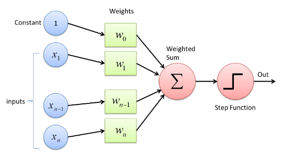

## Basics of Deep Learning

## What is perceprtron?

Perceptron is a single layer neural netwrok which deals with binary seperabale or linearly seperable datasets.
The input layer can't be considered as any layer.

All the inputs get passed to the hidden layer neuron with some weights. In the hidden layer neuron there we perform two steps as given below:

- step1:

Now as seen in the above image, in the hidden layer neuron we will multiply the inputs with the weights assigned to them.

The equation becomes 

z = x1w1 + x2w2 + ... + xnwn + 1*w0
z = sum (xiwi + w0)

Here we assign some constant or bias as w0 bcoz if we don't pass any weights or the weights become 0, our neuron will get deactivated so to prevent this or to keep the neuron active we add some bias or constant to the function.

The above equation is exactly equal to the equation of straight line or linear regression equation

y = mx + c

- step2:
We apply step function on the above calculated equation i.e. Z
We descide a threshold on which the output gets calculated.

Like if we set threshold as 0.5, so whenever the z > 0.5 the output of that neuron will be 1 else 0.

and the output we will get as the output of our perceptron.

This is called as forward propogation

### **If the output is incorrect for any specific records, then we will change or update the weights and again train the neuron with the updated weights**

This is called as backward propogation

