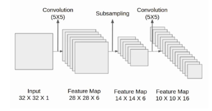

## There are various CNN architectures 

There are different architectures in CNN because for better accuracy researches tried to change various layers of CNN like:
1) Change Convolution layers
2) Change filter size
3) Change stride
4) Change Padding
5) Change the ANN layers
6) Change the activation functions
7) Change the dropout layers
8) Apply or change normalization

So with the help of changing above layers or parameters we came to know the below differnet architectures of CNN.

1) Lenet - 5 (5 because there are 5 layers)
2) Alexnet
3) VGG - 16, 19
4) Inception
5) Resnet

## Lenet - 5

It's a classifiaction architecture for recognizing the handwritten and machine-printed characters. There is input limit for this architecture. It can take input <= 32. 

input size = (32*32*1) only grayscale images
**Also in the whole architecture they have used TanH activation function only.**

- In first convolution layer they took 6 filters of size 5*5.

- After that applied the average pooling and the size of the feature map is reduced by half.

- Then in 2nd convolution layer they used 16 filters of size 5*5, and again used average pooling layer which reduced the size of feature map to half 5*5*16.

- In the 3rd convolution layer they used 120 filters of size 5*5 which acts like a flatten layer and gives the feature map of size 1*1*120

- After these convolution layers, we have a fully connected layer with eighty-four neurons. At last, we have an output layer with ten neurons since the data have ten classes.

The final architecture diagram will looks like below:

## Summarization

## Alexnet

## Visual Geomtery Group (VGG)

## VGG-16

In VGG - 16

For all convolutional layers:
- Filter size = 3*3
- Stride = 1
- Padding = same wherever padding is used

For all maxpooling layers:
- pooling size = 2*2
- Stride = 2

Th summary of the VGG-16 architecture is given in below image

**The last layer of ANN will contain 1000 neurons as output layer not 4096**

## VGG - 19

**The only difference in VGG-16 & VGG-19 architectures, VGG-19 has more convolutional layers included**.

## Why do we use pre-trained model / Transfer Learning in CNN?

- CNN needs much more data to train, so we need large amount of data which is not possible to train any new model.
- Training time will be much higher as the models are much complex to train.

We use already pre-trained model with the pre-trained weights on our custom data, so we will get better accuracy.
Only we change the ANN configurations, we will keep CNN parts as it is from the pre-trained model

## Why 3x3 filter works more better than 5x5?

As in 3x3 we use only 9 parameters and in 5*5 we use 25 parameters so more number of parameters means more computation required.

Also if the output of 1st Conv layer with using 5x5 filter will be more than 2 Conv layers of 3x3 filter. So in 2 Conv layer we will be able to extract more features than in only 1 layer.

## Why do we try to not use Fully-connected layers in CNN architecture?
- So in any of the architecture we are already using multiple neural networks, and high number of filters. So the trainable parameters i.e. weights increases.
- As number of parameter increases the training and computation cost increases.
- In addition to that if we use FC layers, we are again increasing the computational cost, hence to avoid that we try to reduce FC layers instead by just convolutional operations it is better to bring down the image size to 1x1 and directly the output layer.

