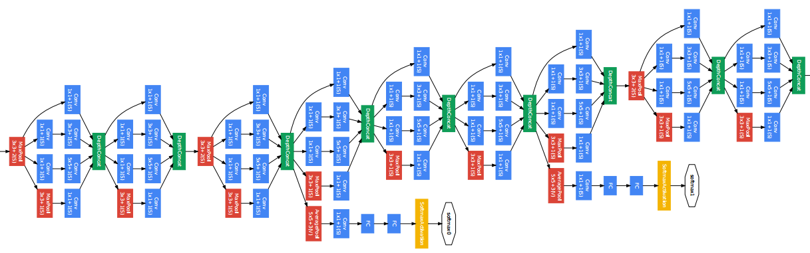
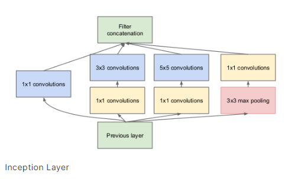

## Inception (Google Net)

Inception contains 22 layers.
Here in inception, we have used so many new concepts like multiple softmax function, average pooling and max pooling both, 

- In the whole inception architecture, we have used inception layer multiple times as shown in above image.
This layer consists of combination of all those layers (namely, 1×1 Convolutional layer, 3×3 Convolutional layer, 5×5 Convolutional layer) with their output filter banks concatenated into a single output vector forming the input of the next stage.

- Now this inception layer we have used multiple times and also used softmax activation function called as Auxillary classifiers to maintain the gradient of the activation function.

- As we know that in very deep neural network we have a problem called vanishing gradient problem with relu or sigmoid activation function in back propogation.
- Hence to prevent that we are using multiple softmax function to keep on going the network without vanishing.

- In inception architectures we are in total using 9 inception layers.

## Why we use inception layer here?

- First of all, we are performing aggregation operation at the end of all filters. Like we are using multiple filters of size 1x1, 3x3. 5x5 and maxpooling layer.
- So after each operation, there might be some information loss but when we are aggregating in last, the amount of information again restored.
- After concat the result is more or less same, like there will be no much information loss hence we have revived our original information and also extracted as much as information possible. 

## Resnet proposed by Microsoft

Resnet contains 152 layers which has best accuracy among all tries.

- Here we have 34 layered Resnet model.
- Here they have used pure convolution operations only.
- Stacked multiple convolutional layers with different filter sizes.
- Here in between we can see dotted lines or /2 operation in convolutions, so that is used for dimensionality reduction using 1x1 filter and a Maxpool layer to reduce the size by half.

