## Convolutional Neural Network (CNN)

CNN mainly used for image, video related datasets.
ANN can solve the image dataset but cannot get much better accuracy as CNN get.

## RGB & Gray scale channels

In CNN, every image is a combination of 3 color channels.
1) Red
2) Green
3) Blue

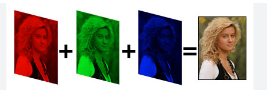

now in every colorful image in background there are pixels. The pixel value ranges from (0, 255) for every color Red, Green and Blue

In gray scale there is only one channel with (0, 255) pixles.
That pixel value for white becomes 255 and for black the pixel value is 0

## Convolution Operation in CNN:

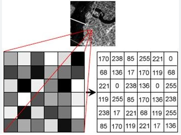

Now let's take an above image.
This is a black and white image so the matrix values ranges from (0, 255)
0 means black and 255 means white.

- step1: We will perform min max scaler on this data first to convert all the values within range (0, 1) as min becomes 0 and max becomes 1.
- step2: Now we apply one filter on top of the above matrix.

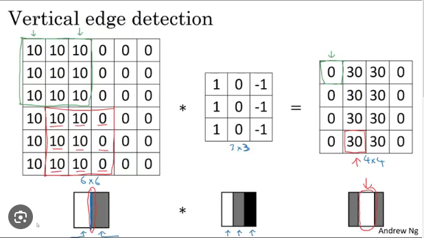

Now as shown in the above image, we apply filter on top of the original matrix. Multiply the same values and add all the values.

like for first 3 rows and first 3 columns.
value = 10x1 + 10x0 + 10x-1 + 10x1 + 10x0 + 10x-1 + 10x1 + 10x0 + 10x-1
value = 0

so this 0 will be placed at first place in new matrix

After finding the first place of new matrix we will shift the filter one step right and after all right completed we will shift the filter one step down.

Now like this we will fill all the boxes of new matrix.

Now here in the above image the input matrix is 6*6, filter is 3*3 but output matrix is 4*4.

The formula for output matrix is,

- output = no of input - filter + 1
- output = 6 - 3 + 1
- output = 4

- step3: Now again apply minmax scaler to re-normalize the matrix, the highest value becomes 255 and lowest becomes 0.

So in our case 30 becomes 255 and 0 becomes 0

So we are able to get the vertical edge of the original image from the output matrix.

**So the filter which we have applied here is called as vertical edge filter and used to detect vertical edges from the image.**

As we learn to apply and update weights in ANN, we need to learn and update this kind of filers in CNN to detect edges from the image

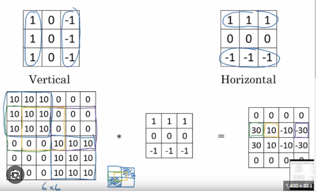

Now if we apply the second filter, it will be used to detect the horizontal edges from the image.

We have seen above that we have input matrix is 6*6 we are applying filter of 3*3 but we are getting output matrix as 4*4. So surely we are loosing some of the information here.

So to prevent this we use the next technique which is padding.

**We never use even size filters as in 2*2 or 4*4 because it has the symmetry issues, we only use odd size filters**

## Padding:

To add padding means to add boundary to the input matrix. Now there is formula to decide how much padding we need to add.

- output = n - f + 2p + 1

Now we know the final output should be 6 because input matrix is 6

- 6 = 6 - 3 + 2p + 1
- 6 = 4 + 2p
- p = 2/2
- p = 1

Now one layer of padding we will add to the input matrix so that after applying 3*3 filter the output matrix would be 6*6 matrix.

Now there are two types of padding
1) Zero padding: add zero to all the padding cells.
2) Neighbour value padding: Add the neighbour value to the padding cells

After applying padding the new input matrix becomes 8*8

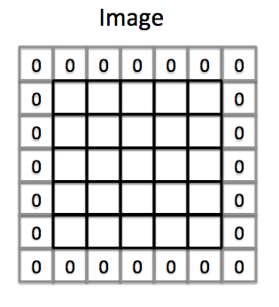

**After this convolution operation we will apply Relu activation function to the matrix**

## Why do we use activation function in CNN

As we have seen in ANN, to learn the neural network better from the data, we need to minimise the loss and for that we need to update weights.

In back propogation to update filters in CNN, we need to use activation function.

We have considered black and white image so the input matrix becomes 6*6*1 as only one black & white channel is there.
But if we have coloured image then it would have been 6*6*3 as 3 RGB colour channels will be applied to input matrix.

Also in the filters, it would have been 3*3*3 for coloured images.

## Max-Pooling:

- Max pooling is performed on the convolutional layers of a CNN. 
- It involves sliding a window (often called a filter or kernel) across the input data, similar to the convolution step, but instead of performing a matrix multiplication, max pooling takes the maximum value within the window. 
- This maximum value becomes a single pixel in the new, pooled output. 
- The window is then slide across the input data by a stride of a certain number of pixels, and the process is repeated until the entire input image has been processed.
- Typically, the size of the pooling window is 2x2, and the stride with which the window is moved is also 2 pixels. 
- This setup reduces the size of the input by half, both in height and width, effectively reducing the total number of pixels by 75%. (information loss is 75% and dimension reduction is 50%)

## Min-Pooling:

This is exactly opposite to max-pooling, min-pooling will consider only minimum values from the input matix.

## Mean-Pooling:

This will take average of the values from the input matrix

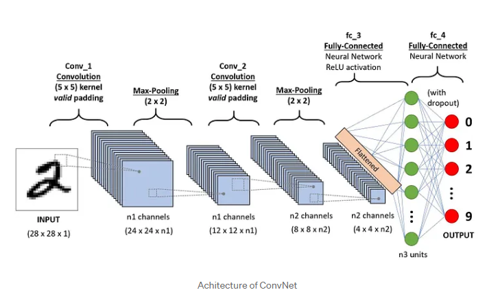

In the above image, first we have applied a convolution layer on the image.
The image is of 28*28*1 for black and white

Then we apply 5*5 filter on top of this image the output matrix will become 24*24*n1 as we will apply n no of filters to the matrix

output = 28 - 5 + 1
output = 24

Then we will apply a max-pooling of 2*2 so the output matrix will become 12*12*n1

Then again we will apply convolution layer on top of this output and again we will apply max-pooling layer.

## Max-Pooling in odd number of image size

Let's take an example of 7x7 image, and we want to apply max-pooling on this, how to do it?

So whenever we have odd number of pixels size we divide them as left side should be smaller than right side.
like in 7x7, we will divide the image from 3x4

## Flattening:

The flatten layer lies between the CNN and the ANN, and its job is to convert the output of the CNN into an input that the ANN can process, as we can see in the above diagram.

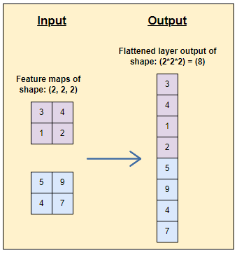

As in the above image all the pixel values will get arranged in a single matrix, and then this matrix will get pass to the ANN

The final image will looks as below when we apply a CNN + ANN for a image classification problem

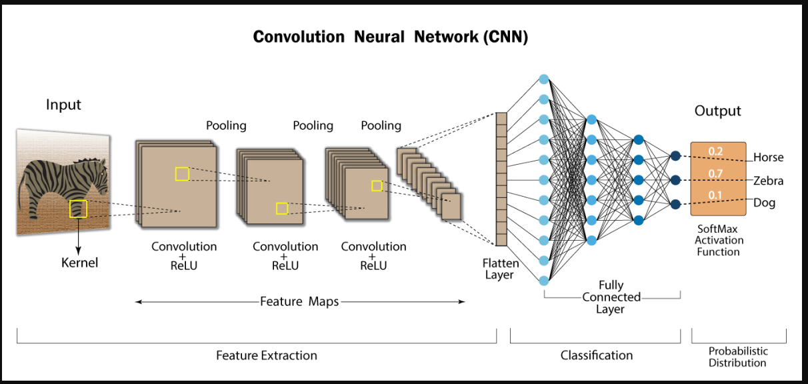

## Receptive Field:

**Deconvolution**:
When we do the reverse of convolution process like starting from input image pixels then apply convolution layer with some filter. So if we do reverse of this like starting from flattened layer 1x1 pixel then add filters and bring previous layer of flattened layer. Then this operation is called as DeConvolution as shown in below image.

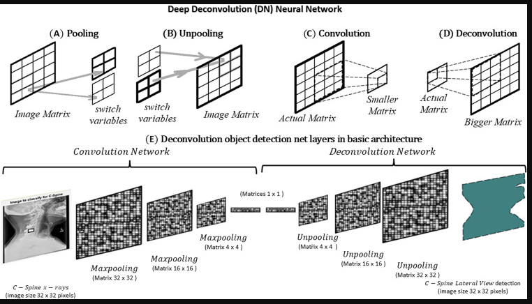

The receptive field, is basically the region in the input space that a particular CNN’s feature is looking at.

exa:- 

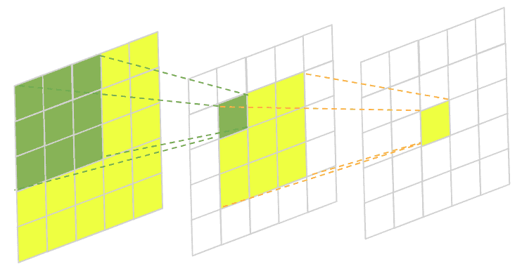

- The receptive field of the first convolution layer is that the green box in 2nd layer is looking at the 3x3 pixels from the input image.
- Similarly, the yellow box in the 2nd convolution layer is looking at the 3x3 pixels from the 1st convolution layer.
- In simple terms the receptive field is the how much imformation that kernel can see? So we always look for global receptive field i.e. from 1x1 we should be able to see the entire image pixels so this type is called as Receptive Field.

## Trainable parameters:

kernel size = m x n x d
here, m = heright, n = width, d = depth (channels from previous layers)

Trainable parameters = ((m x n x d) + bias) * no of filters

exa:- This is for 1st convolution layer. If we use input size = (28 x 28 x 1)
and filters we use 32 of size (3 x 3)

then trainable parameters = ((3 x 3 x 1) + 1) * 32
= 320

Now for 2nd layer, if we use 64 filters of same size (3 x 3) and d = 32 as the filters from previous layer are 32
then trainable parameters are,

= ((3 x 3 x 32) + 1) * 64
= 18496

## Normalisation in CNN (Local Response Normalisation):

- In this wherever we have the highest pixel values, we pass some pixels values to the neighbour of that highest pixel.
- So that the neighbours also have some information.
- If we do this within channel then it is called as Intra-Channel.
- If we do this accross channels then it is called as Inter-Channel.

Refer to the below image.

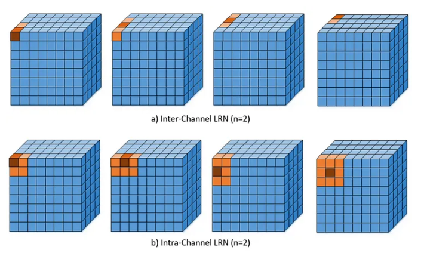