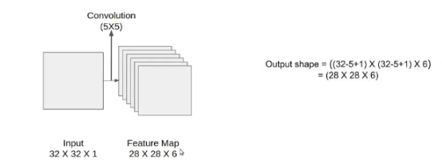
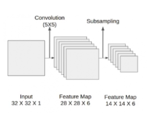
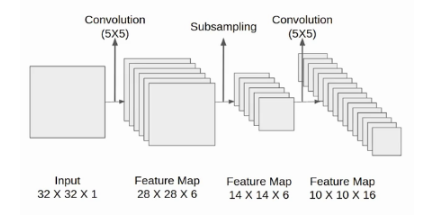
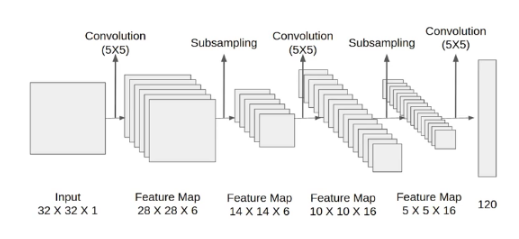
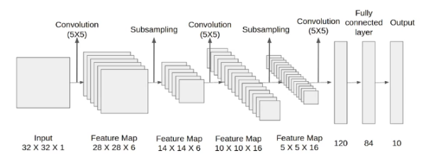
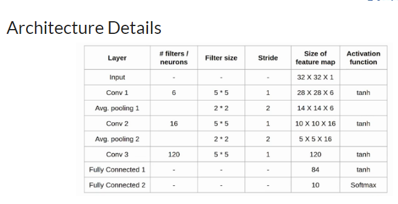

## There are various CNN architectures 

There are different architectures in CNN because for better accuracy researches tried to change various layers of CNN like:
1) Change Convolution layers
2) Change filter size
3) Change stride
4) Change Padding
5) Change the ANN layers
6) Change the activation functions
7) Change the dropout layers
8) Apply or change normalization

So with the help of changing above layers or parameters we came to know the below differnet architectures of CNN.

1) Lenet - 5 (5 because there are 5 layers)
2) Alexnet
3) VGG - 16, 19
4) Inception
5) Resnet

## Lenet - 5

It's a classifiaction architecture for recognizing the handwritten and machine-printed characters. There is input limit for this architecture

input size = (32*32*1) only grayscale images

- In first convolution layer they took 6 filters of size 5*5.

- After that applied the average pooling and the size of the feature map is reduced by half.

- Then in 2nd convolution layer they used 16 filters of size 5*5, and again used average pooling layer which reduced the size of feature map to half 5*5*16.

- In the 3rd convolution layer they used 120 filters of size 5*5 which acts like a flatten layer and gives the feature map of size 1*1*120

- After these convolution layers, we have a fully connected layer with eighty-four neurons. At last, we have an output layer with ten neurons since the data have ten classes.

The final architecture diagram will looks like below:

## Summarization

