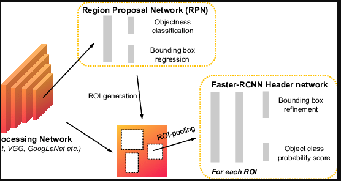

## RCNN (Region based Convolutional Neural Network)

- In RCNN, as the above image tells us that, they have extracted 2k regional proposals from the input image using edge detection and selective search algorithms.
- and performed the wrap operation on the region proposals and then passed to CNN models.
- In RCNN, they used 3-stage training like below:

- 1) fine tune using log loss
- 2) classifies the class of object using linear SVM
- 3) bounding box regressors.

**Disadvantages of RCNN**
- 1 image is converted to 2000 Region Proposals, now let's imagine if we have 50k training images. Then that 50k images wll convert into 2k region proposals for each image like 50k * 2k
- On top of this we are wrapping a resizing of the image to feed this into any CNN architecture. But this creates an issue of aspect ratio.
- Also we are using 3stage training hence the training computation is heavy for this architecture.

## Fast-RCNN

**We know that if we want to train faster and computationally efficient network then we need to increase the use of Pooling layer in the network**
Because it will delete the information and dimensions drastically.

In Fast-RCNN we follows the below steps:

- The input image is passed to a CNN model as well as it is passed to find out to models like edge detetction and selection search to extract the region proposals.

- Now the CNN model will extract the feature which might be detected in the region proposals, but the point of passing the image to CNN models is to maintain the aspect ratio of images which is a drawback of region proposals.
- Then this region proposals will pass to region of interest (ROI pooling) layer which will make the sizes of all extracted RPs same close to 7x7 using the single level SPP layer.
- SPP means Spatial Pyramid Pooling, this was used in SPPNet architecture. They used 3 max-pooling layers of 2x2, 4x4 and 6x6. So in Fast-RCNN they used single level max-pool layer of 7x7. 
- Means the output of ROI pooling will be the extracted regions of interest will be of same size close to 7x7

- Now in RCNN they have used 3 stage training, in Fast-RCNN they have used 2 stage training.
- 1) Fine tune using log loss + softmax activation for classification
- 2) Boundig box regressor to give the bounding box co-ordinates. 

**Disadvantages of Fast-RCNN**
1) Fast-RCNN is also slow as it extracts features from each image, and also find the region proposals from each image.
2) So this is also a time consuming algorithm.

## **Faster RCNN**
In Faster RCNN, they have replaced the traditional image processing algorithms to detect region proposals which are edge detection and selective search, with the Region Proposal Network (RPN).

- In the above image, we can see there is a layer called Region Proposal Network (RPN). So instead of using Selective search and edge detection they have used a deep learning network called RPN.
- They have used either Alexnet/VGG model and predicted two things:
- a) Bounding box co-ordinates
- b) Background (there is no object) / Foreground (there is object).

- So here we are able to get the predictions of object and bounding box two times, as RPN first does it, and then after ROI, the model itself again does this.
- Hence the network gets improved.

**Training of Faster-RCNN**

Here ConvNet1 means the Convolutional architecture used in RPN
COnvNet2 means the Convolutional architecture used in Fast-RCNN model.

- 1) Train the RPN using ConvNet1
- 2) Train Fast-RCNN using ConvNet2, now in this the already trained RPN output i.e Region proposals will also come so the Fast-RCNN will train easily.
- 3) Fine Tune RPN using ConvNet2 to get better region proposals. This is important as we first train RPN on imagenet weights and in back-propogation we want to train this with out custom weights.
- 4) Fine Tune Fast-RCNN using ConvNet2 and new proposals.

