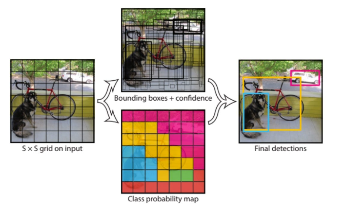

YOLO (You Only Learn Once) is the object detection framework of Single Shot Detector family unlike the other which we seen so far RCNN, Fast-RCNN, Faster RCNN.
YOLO uses only one neural network for predicting the bounding boxes.

Hence YOLO is faster than others but accurcy wise its lesser than others.

## Architecture

**In YOLO, we divide the image into nxn grids, and assume that each grid must contain the centre point of the object.**

For this we can say, more the grids, bigger the image and vice versa.
But we know that is not possible for each and every grid.

Hence we uses sliding window technique, it will slide through each and every grid of the image.
as given in the below image,

Now as we consider the object in the image, it will consist of multiple grids, and also there can be overlapping of ojects of each grid.
Hence for each grid of the image there will be multiple bounding boxes.
And bounding box contains the co-ordinates and confidence score of class.

## Hence YOLO uses Non Max Suppression (NMS) algorithm

This filters out the bounding box which is most relevant one with the highest confidence score.
Now in most of the cases, the grid which has the centre point of the object, the bounding box related to that grid will have always the highest confidence score.

## Intersection Over Union (IOU):

This is basically the intersection between the ground truth and bounding boxes.

1) No Overlap:
If the ground truth is not overlapped with bounding box, then our prediction is incorrect.
It should be totally overlapping so that our prediction is correct.

2) Some overlap or intersection`:
This means some what overlap is there between ground truth and bounding box.

3) 100% overlap:
The bounding box is equal to groun truth.

The IOU is given as:

**IN YOLO, the threshold for IOU is always > 50%.**

