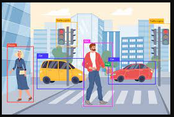

## Object Detection 

In object detection our aim is to define where the object is in the image.
So where means we have to find out the location or co-ordinates of the object from that image.

So to find co-ordinates the axis is always +ve on both x & y sides
Like the origin is top left corner of image, and down the line through y-axis is +ve y-axis and right side of origin is +ve x-axis.

In the above image the different rectangles define the different bounding boxes. Each bounding box refer to an single object in the image.
