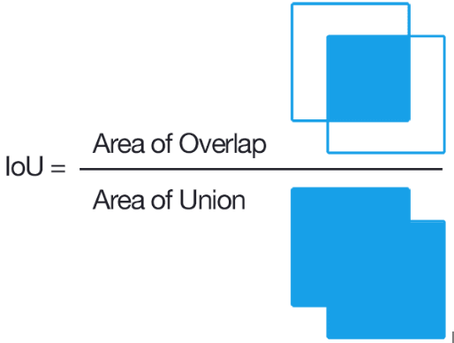
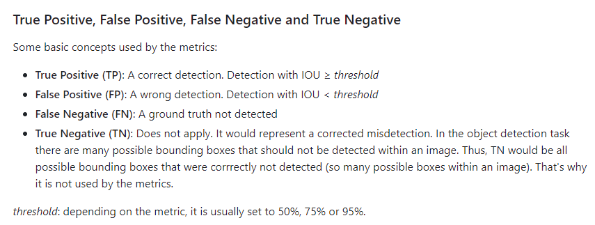
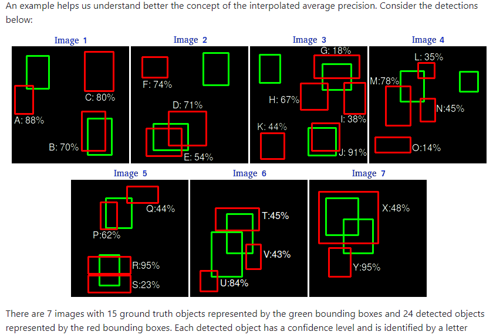
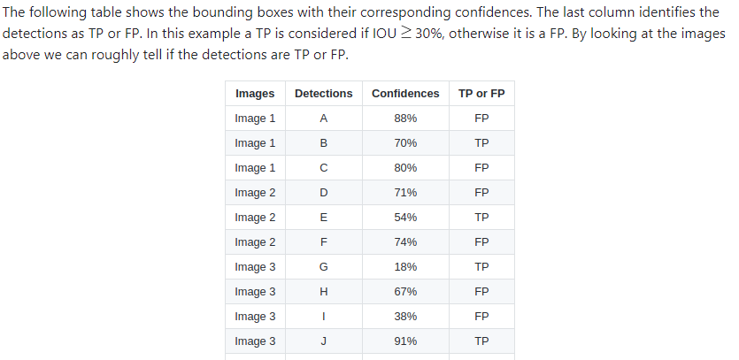
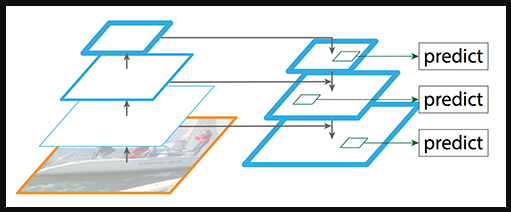
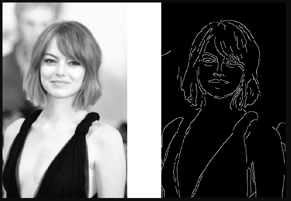
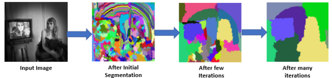

## Object Detection 

In object detection our aim is to define where the object is in the image.
So where means we have to find out the location or co-ordinates of the object from that image.

**Object Detection always comes with image classification and regression problems**
like object = classification + regression

- classification will tell us what type of object it is
- Regression will tell us where the object is located in an image.

So to find co-ordinates the axis is always +ve on both x & y sides
Like the origin is top left corner of image, and down the line through y-axis is +ve y-axis and right side of origin is +ve x-axis.

In the above image the different rectangles define the different bounding boxes. Each bounding box refer to an single object in the image.

Now to create a bounding box we need to know the location of object and to know location we have to know the co-ordinates of object. Hence predicting the co-ordinates means number become regression problem.

So to create a rectangle we will always require 4 points:
a) either (x1, y1) & (x2, y2)
b) or midpoint with (x, y) and height & width (h, w)

**Predicting this co-ordinates is the main aim in object detection, which the conventional CNN cannot do, as softmax activation function cannot predict the regression problem**

## Why do we always use rectangle to detect and object and not circle?

So the idea behind the rectangle is that we want to minimize the background noise in the bounding box.

If we compare the rectange of height 20 and width 80, so the centre point will be 40.
Now if we try to draw circle of radius 40 it will be much bigger than the rectangle so it will contain more background noise than rectangle.

And also we can stretch the height or width of rectangle as per the object, that cannot be done with the help of circle.

## Bounding Box Regression

Now we have the Ground truth points which are the actual co-ordinates of the boundig box and the predicted co-ordinates of bounding box.

- We will use here L2 Loss to check the accuracy of our predicted co-ordinates.
- The difference  between ground truth and predicted co-ordinates should be minimum.
- So the model should predict the co-ordinates in such as way that the loss value should be minimum

## Metrics in Object Detection

1) Intersection Over Union (IOU):
The area of intersection between the two bounding boxes is called IOU

The formula is given as,

0 < IOU > 1 ; 0 is worse and 1 is perfect.

- If the IOU is 0, then it means the predicted boundix box is not overlapping with the Ground Truth i.e. actual bounding box of object
- Hence the more IOU, the better object is detected.

2) Confusion Matrix:

**The confusion matrix in Object Detection**

So in object detection we uses classifiaction + regression, so classification score is given as confidence score. The higher the confidence score it means it is predicted what object it is in ground truth correctly.

3) Average Precision:

**Interpolation Method**

In this we average precision value with either all points or through only specific number of points.

    

4) Mean Average Precision:

Mean Average Precision (MAP) is basically the average of AP for all the output classes.
for exa:  if we have 5 output classes for dog, cat, horse, zebra and giraffe then MAP will be the average of AP for all the 5 classes.

## Sliding Window

Sliding window is basically a window of some size x ,y and we will slide that window all over the image like we do convolution operation in CNN.
So sliding window does not extract any features from particular window of the image, it actually scans the image to look for the object in image.

**The problem in sliding window is the size of sliding window**

Because if we set sliding window size small, then person may not fit in that window. And if the object is small and we set sliding window size high then it will capture lot of background along with the object.

The sliding window will detect whether there is an object is not with the help of edge detection.
Now we know if there is any object there will be lot of edges.

## Sliding Window with Image Pyramid
To overcome the above said issue, we rescale the image in different sizes, and then use the sliding window of fixed size over all the size of images.

So from this we will be able to get the object. 

**Now the problem with this approach is we need to scan the entire image, when we don't need to also. We know that most of the times object lies at the centre of the image so we can use below two new techniques**

## Edge Detection:
1) Canny Edge Detection:

In the above image, we can clearly see that if there is an object then the edge detection will detect it with the edges, but it will be black and white and to detect what type of object it is we need to know the colors of object also.

So for this we have another technique 

## Selective Search

This will group the similar colors, composition and texture pixels into groups to detect the object easily with colors.

In this above image all the pixels with similar colors are grouped togther we can detect that there are this objects in the image.

**So now with the help of edge detection and color grouping we can decide where the object is located in the image.**

- So whatever the objects are detected through this two techniques are not the final objects, they are object are not will be confirmed by the model training. 
- But this techniqes helps us to atleast propose that there might be an object so it is called as **Region Proposal.**

- Now this Region Proposals are then sent to the model like VGG, Resnet.

- But there is one problem, we cannot pass directly the Region Proposals to the model, as every model has their input size constraint. so we need to first resize our Region Proposals to the input size that the model accepts. This resize operation is called as **Wrap Operation.**

**Now again after wrap operation there are many problems, blur image can come, image distortion can happen this called as aspect ratio problem.**

