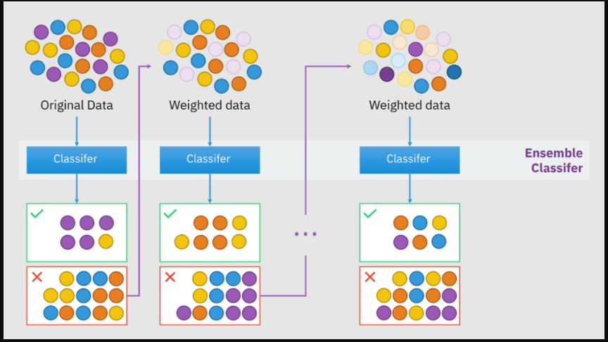
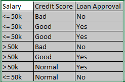
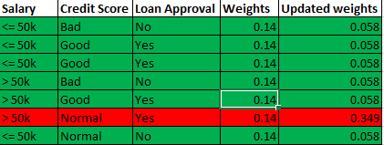
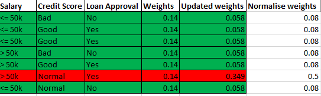
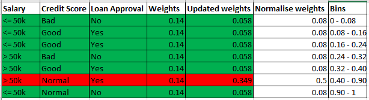

## Adaboost

## **Why boosting is required?**

Let's take an example if we train a decision tree only till 1st depth (also called as stump) which might lead to *Underfitting* condition.

Underfitting : Training Accuracy low & test accuracy (low/high)
In technical terms, High bias & Low/High Varince

Now using boosting techniques we can convert this High bias to low bias & high Variance to low variance.

**Why we use weak learners in boosting?**
Because weak learners will learn less so that they won't get overfitted.
and by combining many of such weak learners sequentially we will get our high leanered or strong learner.

## Concept behind Adaboost

As shown in the above image, let's say we have taken Random forest as our model
now we will train our RF model in a sequential manner.

- So first we will provide dataset to first RF weak learner, it will predict some data points correctly and some not.
- Whichever data points are incorrectly predicted will be then pass to next RF weak learner with assigning some weights.
- Weights are assigned with the help of below function

f = alpha1(M1) + alpha2(M2) + ..... + alphan(Mn)

Here, 
alpha1, alpha2, ...., alphan = weights
M1, M2, ...., Mn = Weak learnerd (here DT with 1 depth)

Let's understand this with the below problem,

- So first of all we will pass the above data to 1depth decision tree. There will be 2 columns i.e. Salary & Credit which we need to decide to which column decision tree we should go for.
- And to decide the decision tree root node we have two methods *Entropy or Gini Impurity* so which ever split is most pure we will go for that root node.
- So let's suppose We have taken *Credit score == Good* as root node of first decision tree.
- Now if we find out the split w.r.t credit score = Good

we will be getting 

credit score = Good
yes - 3Y/0N
No - 1Y/3N

Now by looking at root node we should'nt get 1N for loan approval when credit score is good that means this is the wrong prediction.
- We will assign some weights to all the data points and intially it will be same for all the data points which is 1/no of data points
- Calculate the total error by adding up all the weights of wrongly classified data points.

= 1/7 as we have only one record for wrong prediction and it's weight is 1/7

- Calculate the performance of stump

= 1/2 log[(1-Totol error)/Total error]
= 1/2 log[6]
= 0.89

So the performance of stump = 0.89 which is pretty good score.

- Now we have seen the function above 
f = alpha1(M1) + alpha2(M2) + ..... + alphan(Mn)

here alpha1 = 0.89 as the performance of stump 
M1 will the prediction of model1

- Update the weight for correctly & incorrectly classified data points
For correctly classified data points the formula is,

= weight * e^-performance
= 1/7 * e^-0.87
= 0.058

- So if we see the new weights of correctlty classified data points the weights get decreased as intially weight was 1/7 and new weight is 0.058

- For wrongly predicted data points the weight formula is,
= weight * e^performance
= 1/7 * e^(0.876)
= 0.349

- So for incorrectly classified data points the weight increases as per the initial weight.

So the updated table will looks like

- Next step is we need to normalise the weights so that the sum of all the weights should be 1. for this we will divide every weights by sum of weights.

- Now we will assign a bin

- Now as we see in the above table we have created bins by cumulating all the weights. The bin for wrongly classified data points is much higher as it has higher weight value.
- So for the 2nd weak learner the data points we will randomly selected from the above table and also from the original dataset. The use of creating bins is when we select randomly the bin for wrongly classified data is much higher so there is much higher probability of getting selected that data point as input for 2nd model
- Now from the 1st step till this step all the steps will be performed for all the models sequentially.

## **Now we will see how the final prediction happens**

So we have seen the function given above for this model,

f = alpha1(M1) + alpha2(M2) + ..... + alphan(Mn)

so let's assume we have trained 4 models and the alpha values are

alpha1 = 0.896
alpha2 = 0.650
alpha3 = 0.38
alpha4 = 0.20

and the outputs of 4 models are,
m1 = Yes
m2 = No
m3 = Yes
m4 = No

the function will be given as,
f = 0.896(Yes) + 0.650(No) + 0.38(Yes) + 0.20(No)
f = 1.2(Yes) + 0.85(No)

So the output Yes has more weightage than No hence the output of our model will be Yes.

