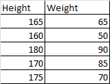
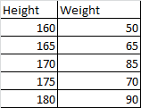
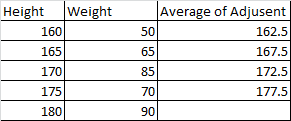

## Decision Tree Regressor

Now for the regression problem statement, somewhat steps are similar to that of the decision tree classifier with numeric values.

**Steps to perform decision tree regressor**

Let's take an sample dataset,

1) Sort the values in ascending order.

2) Find out the average of adjusent values.

Now as in Decision Tree Classification, we find out the three things
- Entropy
- Gini Impurity
- Information Gain

In Decision Tree Regressor we have to find out the three terms which are,
- Mean
- MSE / MAE / RMSE
- Reduction Variance 

3) Find out the above 3 terms for each average of adjusent values.
Now if we take the first value from average of adjusent values i.e. height = 162.5,
then the split becomes 

Height <= 162.5 and Height > 162.5

For Height <= 162.5 the weight = [50]
For Height > 162.5 the weight = [65, 85, 70, 90]

Now we will see the first method 
1) Mean:-

First find out the mean of all weights = 72
then the mean of weight of each split i.e. <= 162.5 and > 162.5

height <= 162.5 the mean weight is 50
hight > 162.5 the mean weight is 77.5

2) MSE:-

MSE is basically the error between the actual and predicted values, also called as variance.

MSE = 1/n sum (y - y^)^2

MSE (Height) = 1/5 * (50-72)^2 + (65-72)^2 + (85-72)^2 + (70-72)^2 + (90-72)^2
MSE (Height) = 1/5 * 484 + 49 + 169 + 4 + 324
MSE (Height) = 1/5 * (1030)
MSE (Height) = 206

MSE (Height <= 162.5) = 0

MSE (Height > 162.5) = 1/4 * sum (65-77.5)^2 + (85-77.5)^2 + (70-77.5)^2 + (90-77.5)^2
MSE (Height > 162.5) = 1/4 * (156.25 + 56.25 + 56.25 + 156.25)
MSE (Height > 162.5) = 1/4 * (425)
MSE (Height > 162.5) = 106.5

3) Reduction in Variance:- 

Reduction in Variance = Var(root) - sum (mod(Sv)/mod(S) * Var(child))
Reduction in Variance = 206 - sum(1/5*0 + 4/5*106.5)
Reduction in Variance = 206 - (85.2)
Reduction in Variance = 120.8

So this is the Reduction in variance for the first value of adjusent average.
Now similarly, we have to find out the reduction variance for all adjusent average values.

Wherever we are getting the lowest Reduction in variance we will select that values as first split.

### **Hyper parameters in Decision Tree**

1) Criterion:- Gini and entropy.
2) Max_depth:- Till which depth we want to create a decision tree (no of levels, the root node is considered as level 0)
3) min_samples_split:- Minimum no of samples should be there in node to create further split of tree.   
exa:- if min_samples_split = 5 and if we have 3 samples in any of the node then we will not divide that node further. wherever it has samples > 5 it will divide the tree further.  
4) min_samples_leaf:- Same as above but there should be fixed min samples in leaf node which we will select can be considerd as leaf nodes else not.    
5) Max_features:- Maximum no of features we should consider to split a tree.

### **Pre-pruning & Post-pruning in Decision Tree**
This concept is used to reduce the overfitting problem of decision tree.
The word pruning means cutting or deleting.

1) Pre-Pruning :- Before creating a decision tree we limit its splits, its depth and this is called as Pre-pruning. While creating a decision tree itself we decide to set values of parameters like Max_depth or Min_samples_leaf or Min_Samples_Split or Max_features.

2) Post-Pruning :- In this we first create a complete decision tree, and then limit the decision tree.
and for limiting the decision tree, we have a parameter called *"ccp_alpha"* (Cost-Complexity Pruning).
We use this ccp_alpha value as a threshold value w.r.t Gini Impurity or Entropy.

Lets suppose we take ccp_alpha = 0.4
First we will create a decision tree till its depth so already Entropy or Gini Impurity is calculated at each node. So we will just check that value is less or greater than our threshold value. So till whichever depth our threshold is greater we will take untill that level only.

So the Gini Impurity or Entropy increase as we go down in the tree.
If ccp_alpha will very high, the decision tree will be almost till depth

