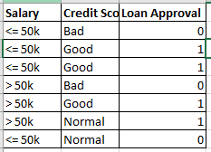
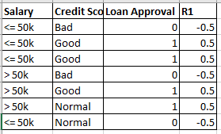

## Extreme Gradient Boost Classifier

Let's suppose we have above dataset given,
It is a classification problem.

The steps to solve the above problem using XGBoost are as follows:

- *step1:*  Create a base model using the average of the actual target column.
In our case it will be 0.5. Calculate the residuals by subtracting the average value from the actual values of target column.

- *step2:* The step 2 will be again construct a decision tree with all the independent variables and target variable as residual of 1st model.

- *step3:* calculate the similarity weights given by below formula,

weights = sum(residuals)^2 / sum(prob(1-prob))

The prob in above formula is actually the output of the model on which we are performing this step.

So this similarity weight we will calculate for the root node on which we are splitting the tree, the left & right node.

- *step4:* After calculating the similarity weights we will calculate gain, given by the formula

gain = sum(similarity weights for eac split)

## *How do we find the logg of odds of the base model?*

We will apply logloss on top of the output of base model, given as

log(odds) = log(p / 1-p)

## *How do we find the final output of the model?*

- *step5:* The model output is given as,

o/p = base model o/p + alpha(similarity weight of split)

Now since it's a binary classification problem our output should be ranging from 0 & 1.
But the similarity weight can be > 1.

To solve this problem we will apply sigmoid function on top of the model output.

o/p = sigmoid(base model o/p + alpha(similarity weight))
The similarity weight is nothing but the output of each model.

So from this we will get the predicted values for the 1st model.

Now we will find the 2nd residual from the predicted value of 1st model and the actual values.
Then we will train the 2nd decision tree on all independen variables as x & R2 (residual of 1st model) as y

The final function is given as,

o/p = sigmoid(base learner + alpha1(DT1) + alpha2(DT2) + ....+ alphan(DTn))

