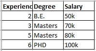
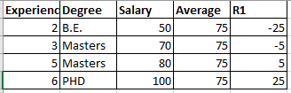
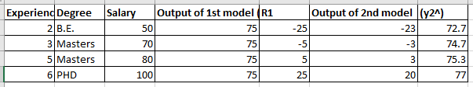

## Gradient boosting is a boosting algorithm in ensemble techniques.

In this we will see a regression problem statement.

So let's take an above example to solve.
Following are the steps to perform gradient boosting

- *step1:*  Create a base model i.e. just an average of target feature.
in our case it is average of salary column is 75K

- *step2:* Compute the residuals or errors (R1)

Find the difference between actual value and predicted value.

- *step3:*  Construct the next sequential decision tree with input as all independent features and target column as residual of first base model.

Now as shown in above image, we have computed the residuals of first model and using this residual as target column we will train our 2nd decision tree.

Now this 2nd model will predict some values.
Using this values we will find our 2nd predicted values

- predicted = output of 1st base model + alpha (output of 2nd model)
- predicted = 75 + alpha (let's consider this as 23)
 
Here alpha is learning rate so that our model don't get overfitted. 
the value of alpha is 0 < alpha > 1

- predicted = 75 + 0.1(23)
- predicted = 72.7

so our final predicted values for all records will look like,

- *step4:* Now again we will compute the residual values with the actual and predicted values of 2nd model.
and then by considering the target column for the model3 we will train the 3rd model.

Now from model 3 we will get R3 as output of model3. And by using the above function which consist of learning rate we will get to know the predicted value of 3rd model.

We will keep on performing these steps untill we will reduce the residual values.

The final function will be given as,

F(x) = alpha0(h0(x)) + alpha1(h1(x)) + alpha2(h2(x)) + .... + alphan(hn(x))
F(x) = sum(alphai(hi(x)))

where,

alpha is learning rate 0 < alpha > 1
h(x) is output of base learner

