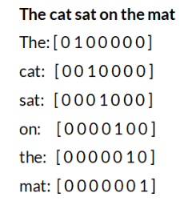
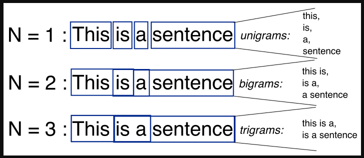
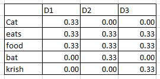
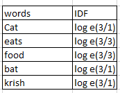

## One Hot Encoding

Let's understand with the example

The one hot encoding is given in the above image for each words, we just put 1 whereever the word is present in the sentence.

**Advantage of One hot encoding**
1) Easy to implement and understand

**Disadvantage of One hot encoding**
1) Create a sparse matrix which means 1 0 matrix with huge size.
2) Out of Vocabulary means (if any word that is not there in training will be discarded)
Hence the sentence size should be fixed.
3) Semantic meaning between words is not captured, (Semantic meaning means the similar meaning words like good, better these are semantic words.)

## Bag of Words (BOW):

Lets take an example

D1 - He is a good boy
D2 - She is a good girl
D3 - Boy and girl are good

So now first step is we will remove the stopwords.
In the above 3 documents, [He, is, a, she, and, are] these are the stopwords that we can remove.

After removing stopwords our documents will be:

D1 - good boy
D2 - good girl
D3 - Boy girl good

So our vocabulary becomes:

good comes 3 times then its frequency is 3.
boy comes 2 times hence its frequency is 2.
girl comes 2 times hence its frequency is 2.

The above data will be our ready to pass data to our model using bag of words.

**If any word is increased in any of the document we will just increase its count from 1 to 2, 2 to 3 and so on.**
**But we have an option in BOW to make it Binary BOW**
**IF there are any words more than 1, then also we will keep 1 and where there it not we will keep 0.**

**Advantages of BOW**
1) Simple and intutive

**Disdvantages of BOW**
1) Sparsity matrix
2) Out of vocabulary (if any word that is not there in training will be discarded)
3) Ordering of words has changed.       
4) Not able to capture semantic meaning.
(Semantic meaning means the similar meaning words like good, better these are semantic words.)

## N-Grams

Lets understand with an example below:

We will use the n number of words together and make one feature from that.
for example,

if we use n = 2, then it is called as bigrams
if we use n = 3, then is is called as trigarms.

exa:- I am not feeling well
how many trigrams will be there?

Ans:- 
1) I, am, not
2) am, not, feeling
3) not feeling well

## To capture semantic meaning we use TF-IDF

Term Frequency - Inverse Document Frequency

This will give more weightage to the words which are more important or rare in particular sentences.

Example:

D1 - Cat eats food
D2 - Bat eats food
D3 - Krish eats food

In the above 3 documents, the only word cat, bat and krish are chaning. Rest of words are same in all documents.
Hence these 3 rare words should given more weightage than other words.

**Rare words are captured by Term Frequency**
**And common words are captured by Inverse Document Frequency**

Formula is given as,

Let's understand this with an example,

D1 - Cat eats food
D2 - Bat eats food
D3 - Krish eats food
Term Frequency is calculated as,

Inverse Document Frequency is given as,

After multiplying 
TF x IDF we will get,

- Since eats and food are present in all the sentences hence, they have not given more weightage.
- Bat, Krish, Cat are the rare words hence they are given higher weightage.

**Advantage of TF-IDF**
1) Intutive
2) Word importance is getting captured

**Disadvantage of TF-IDF**
1) Sparce matrix issue is still there.
2) Out of vocabulary issue is not handled.

