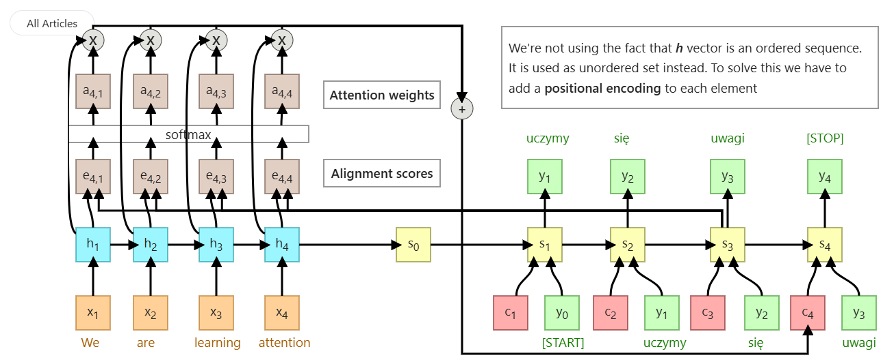

**Difference between encoder-decoder architecture and attension mechanism architecture**

**What's inside encoder?** 
- In this we use Bi-directional LSTM instead of normal LSTM, so that it has the context of whole sentence while training in encoder.
- Then the output of all LSTMs(forward & backward called as S0) is multiplied with the output of encoder LSTMs, and this output is called as Alignment Scores.
- Then the ANN is applied with softmax activation function on this Alignment scores, and get the output.
- Now the point wise multiplication operation will happen between these ANN output for each LSTM, and output of the trained encoder LSTM (i.e. first step)
- And the final output after this will be called as Attension weights which has the information of all the inputs.
- And then one final point wise addition operation is done to find out the context vector(C).

**What's inside decoder?**
- Now the S0 (output of all encoder LSTMs) and the final context vector (C) is passed to LSTM of decoder along with the input (y)
- Then ANN with softmax is applied on the output of all decoder LSTMs
- Now the information from 1st decoder LSTM will be passed to 2nd LSTM along with the output of 1st ANN, but we will not pass the S0 and C directly to 2nd LSTM.
- Instead we will calculate the new S0 and C and pass to 2nd LSTM along with all above.
- This will repeat for all decoder LSTMs.
- SO with this process, we will not loose any information in context vector even if we have very large length sentences and will get much better accuracy.

**Link to the good explaination**
https://erdem.pl/2021/05/introduction-to-attention-mechanism
