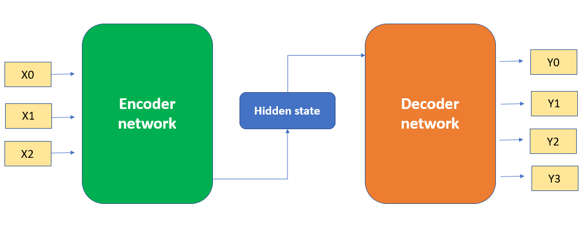
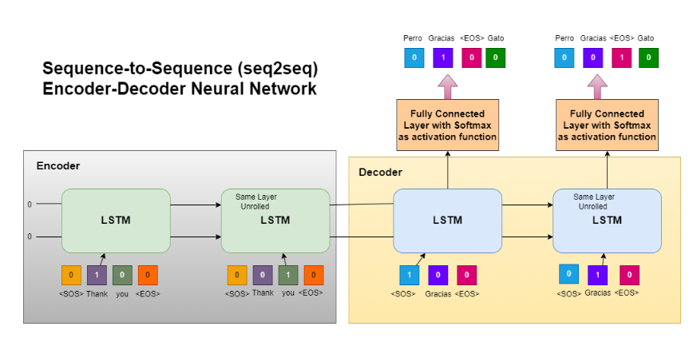

**Whenever we have a use case which is Sequence to Sequence like Machine translation, chatbot, we cannot use any RNN architecture here as it will not be efficient to predict the words based on whole context.**

So there we use Encoder Decoder architecture

- The input sentence is passed to embedding layer to convert words into vectors
- Then those embedding passed to encoder
- Hidden state is called as context vectors which are the vectors of input data
- then it is passed to decoder, it will generate the output word-by-word and keeps feeding previous word into decoder again. 
- use cases:- Language translation, text generation, text suggestions

This is the arcitecture under encoder and decoder looks like:

- The example given in above image is for machine translation as convert english to french.
- In encoders and decoders we use LSTM, and then we pass the words to the LSTM inside encoder.
- After all the input words, the memory cell is passed to decoder LSTM called as context vectors(output of last encoder LSTM).
- Then in decoder LSTM, the fully connected layer with Softmax activation function is applied to get multiiclass output
- And that output along with the LSTM memory cell is passed to 2nd LSTM of decoder as input and then again FC with softmax is applied.
- Now the loss is calculated against the predicted and original outputs and weight updation happens in back propogation accordingly.       

**Problems with encoder-decoder seq2seq architecture** 

- The context vetors which is the output of encoder LSTM for last timestamp, also represents the entire sentence.
- It works very well when we have less sentence length, but it fails when we have very huge as context vectors has much information about the very previous input passed rather than the first input passed.
- So for longer sentences, the context vector will not contain accurate information about whole sentence.
- So we use Attention Mechanism seq-2-seq network.
