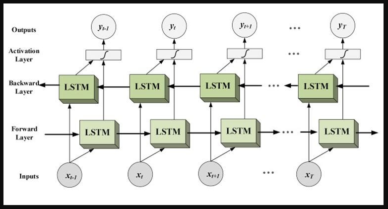

## **Bidirectional Long Short Term Memory RNN**

**Why do we need Bidirection LSTM RNN?**
- In simple RNNs we don't have the access or the context of next word at the time of current word.
exa- we have a sentence as,

Nishchal likes to eat __ in Pune.

- So for this we have to predict the word in place of blank.
- Now in simple RNN, what we will do we will feed RNN with one word at a time and the output of previous word is passed to the next neuron.
- But this will not get the next word at the time of current word training.
- exa while passing the word likes, we cannot give the context of word Pune to the RNN.
- But the prediction of new word is dependent on the word Pune.
- The predicted word may change if the word Pune is changed to Mumbai or something else.

## **Bidirectional LSTM Architecture**

- As shown in the above image, we have two LSTMs, one is training forward and other is training backward.
- The input of last forward LSTM is also connected with the first backward LSTM.
- And the output of last forward LSTM is combined with the output of first backward LSTM
- Similarly as we train forward LSTM, output is passed to next, in backward also we pass output to the next neuron.
- This will help in getting the context of next words to the previous words to predict the words much more efficiently.