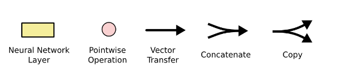
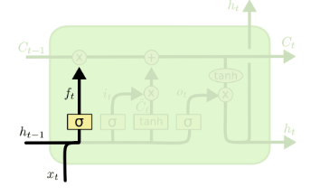
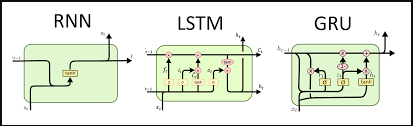
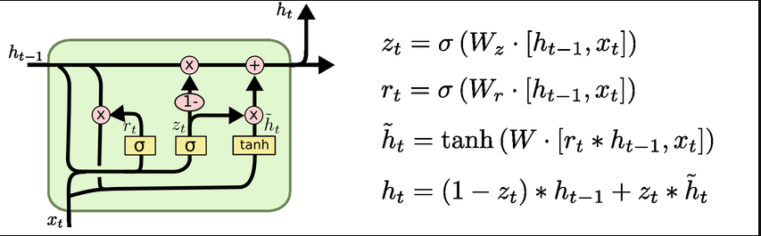

## Long Short Term Memory (LSTM) RNN

The Traditional RNN looks like below:

The LSTM RNN looks like

**Important reasons why we use LSTM RNN**
1) Whenever we have longer sentences, we need to understand the context switching.
for example:

I like pizza but my friend like ____
Now here we need to predict the word in place of __

- But we have started with I, and we have to predict the word for my friend.
- So here the context is switched, and the model should understand this to predict perfectly.
- So this problem is cannot be solved by RNN, hence we use LSTM RNN.

**The symbolic representation in LSTM**

## **Intution of LSTM**

Let's understand this with example.

Nishchal likes pizza but his friend likes burger.

- Now in this sentence, after passing the words Nishchal, likes, pizza we are changing the context from but.
- So the LSTM should forget the previous input and just remember the new context, to predict the next word.
- Lets understand the architecture layer by layer.

**1) Memory Cell**

- This first line is called as Memory Cell. This memory cell plays a role like conveyer belt.
- You can add information or you can remove information.

**2) Forget Gate Layer**

- This layer is called as Forget Layer cell. Whenever we are changing the context of word and passing that word as input, the forget cell will detect that context change and will inform memory cell to forget the previous information.
- How this can be done? So in our above example, when we pass the word friend, the information from previous neurons does not match with this word, hence the sigmoid activation function will make all the vectors nearer to 0 so that the memory cell will forget the previous information.
- If the information from previous neuron is similar to the current input word, then the sigmoid activation function will make all the vectors nearer to 1, hence the memory cell will keep that information in memory.

**3) Input Gate Layer**

- In this layer, we have two operations one is passing the information with sigmoid activation which is similar to what we saw in Forget Gate layer.
- Another is passing the information with TanH activation function, TanH will convert the values from -1 to 1.
- So from sigmoid activation we will give the vector nearer to 0, if the new context is passing, and nearer to 1 if the context is same.
- Tanh will give the vector with values ranging from -1 to 1.
- After pointwise operation between these two vactors, we will get only new context information, which is the passed to Memory cell to store.
- Here the point wise operation is x, that means we will take dot product of two vectors.
- Whenever we have + in point wise operation we will take addition of two vectors.  

**4) Point wise operations**

- Here we are doing the point wise dot product and addition operation on vectors from previous layers.
- This will decide which information needs to be stored and which information needs to be forget from memory cell.

**5) Output Gate Layer**

- In this layer, the Tanh is applied on the vectors from memory cell, and again the forget layer operation i.e sigmoid applied on the input vectors.
- We do the dot product of this two vectors and will get an output vector.

# **GRU (Gated Recurrent Unit)**

**Why do we need GRU?**
The answer to this is, we have two memory cells i.e. Long term and short term in LSTM. So it will require more trainable paramaters and more training time and hardware as it is a complex architecture.

Hence in GRU it is resolved and there is only one memory cell.

As here is only one cell, which is both Long and short term memory cell.

- As there are three gates in LSTM (Input, forget, output) there are different gates in GRU
1) (zt) Update Gate:- The value from memory cell, and input will be multiplied with weight and then sigmoid is applied to that.
2) (rt) Reset Gate:- This is also same as Update gate (multiply input and memory cell value with weight and apply sigmoid).
3) (~ht) Candidate memory gate:- This is weights multiplied with output of Reset gate with input & memory cell value and apply Tanh activation function.
4) (ht) Output gate:- There are point wise operation between Update gate and Candidate memory gate.

**Importance of these gates**
1) Reset Gate:- Reset some information from (ht - 1) i.e. memory cell (both long term and short term)
2) Update Gate:- what context information needs to be included for output this depends on the current context coming from Candidate memory gate.

