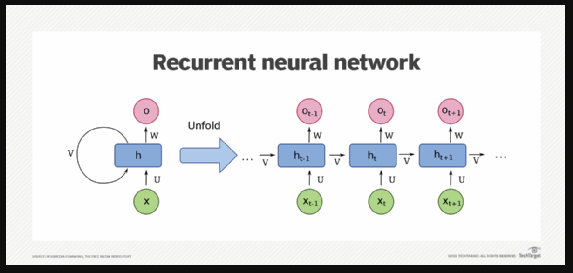
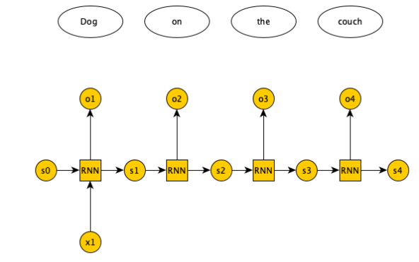
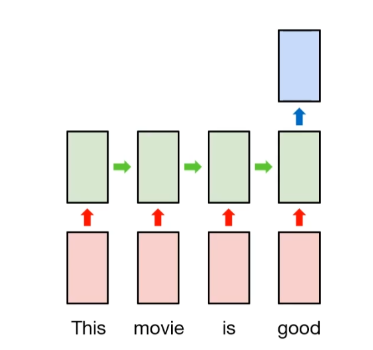
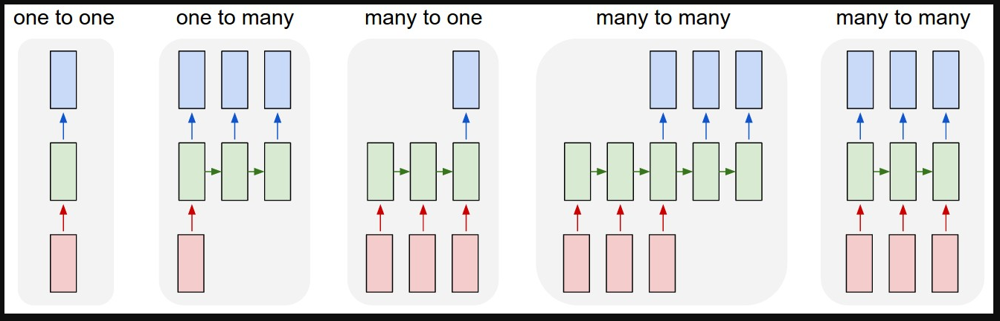
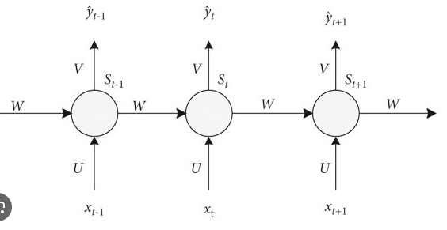

## Deep Learning Techniques

The use cases like Text Generation, Language Translation, Chatbot can't be solved by Machine Learning models.
We have to use Deep learning models here.

Beacuse these require sequence of words and gramatical understanding of sentence.
Hence we have to use Deep learning models like:

RNN, LSTM RNN, Transformers, BERT

## Recurrent Neural Network (RNN)

In RNN, we simply send back the output of neuron again to the neuron.

Let's Deep Dive further.

As given in the above image, we pass the output of neuron to again the same neuron.
Again we will pass the output of same neuron of timestamp t = 1 to the same neuron.
This will keep on going.

Let's take an example of sentiment Analysis

D1 - The food is good.
O/P - Positive

Now the 4 words in sentence will represnt the 4 inputs for the neurons.

- So in training the RNN, the first word x1 will get passed to the first neuron along with some weights and bias.
- The word will get first converted into vectors using Word2Vec technique, and that vector get passed to the neuron at t = 1.
- Now whatever output we will get from the first neuron, we will send it to the 2nd neuron, and input will be the 2nd word at t = 2
- The same process happens for all the words in the input shape at various timestamps.

## Types of RNN

1) One to One RNN
2) One to Many RNN
3) Many to One RNN
4) Many to Many RNN

1) One to One RNN:

- In One to One RNN, We pass the first word as input to the first neuron, and the output of that neuron gets pass to the 2nd neuron. 
- But this time we won't take second word as input, we just use the output of first neuron and go forward.
- And finally we retrive the output after some neuron training.
- In this we are getting one output after passing one input hence it is called as One to One RNN.
- Use case: Image Classification.

2) One to Many RNN:
- In One to Many, we pass input to first neuron only as in One to One, but we can take out the output from any of the trained neuron, unlike the one to one we can take only final output.
- Here we can take as many outputs as we want with respect to timestamps.
- The input is one and outputs are many hence it is called as One to Many.
- Use case: Music Generation, Text Generation, Google Search Suggestion, Movie Recommendation.

3) Many to One RNN:

- In this we take multiple input and output keep on passing to next neurons.
- We take output at the final neuron only so at only point.
- Hence it is called as Many to One.
- Use Case: Sentiment Analysis

4) Many to Many RNN:
- In this we will take many inputs and can take out many outputs.
- Use case: Language Translation, Question Answers, Chatbot

We can refer the below image for all of the above RNN types.

## Forward Propogation in RNN

Let's see forward propogation of RNN in Many to One RNN.

- Now as given in above image, The first neuron will get input of first word and that input gets multiplied with some weight.
- And we will get an output of first neuron which is again passed to the second neuron in Many to One RNN. 
- So that output will again gets multiplied with some weight and the second input for 2nd neuron multiplied with weights will be added to this and then passed to the second neuron.
- Similarly for third neuron the (output of 2nd neuron x weights + input of 3rd neuron x weights) will get pass to it.
- If the output class is multiclass then we will apply softmax activation function to the final output neuron, if the output class is binary, we will apply sigmoid activation function.
- After calculating loss, we will update the weights and again train the network. 
- In back porpogation, we use chain rule to take derivatives of weights as we do in ANN.
- If we have very deep neural network, as we know we face vanishing gradient problem in back propogation.
- As we know sigmoid derivation is 0-0.25 and if we use sigmoid in back propogation we may face the vanishing gradient problem.
- Also one more issue in RNN, is that if some of the words are important to capture, but they are far away from each other so while training RNN, the importance of word may get lost.
- Like if output 10 is dependent on output 1, so bcoz of inbetwen neuron lengths, the importance may get lost during training.
- To overcome this problem we use LSTM RNN.

