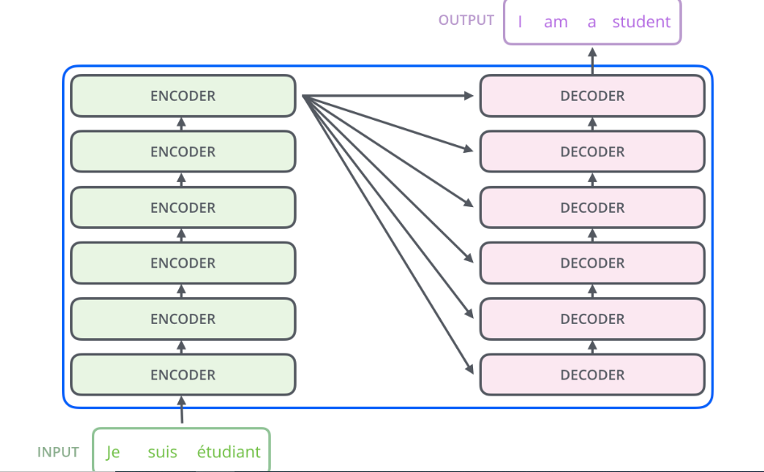
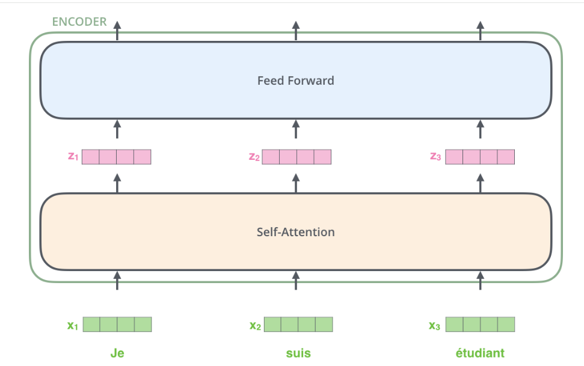
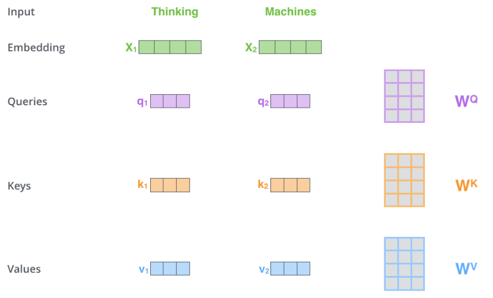
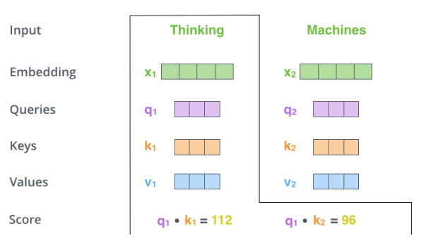
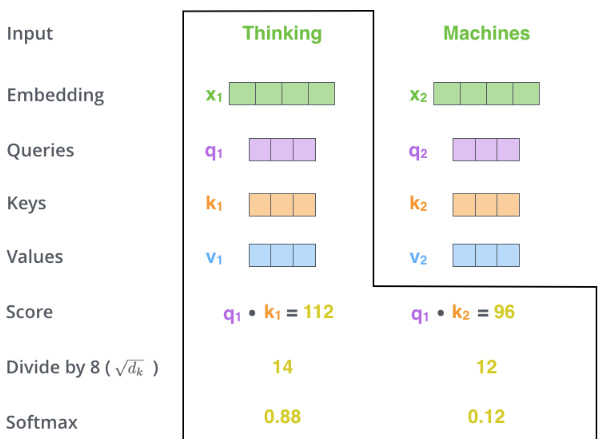
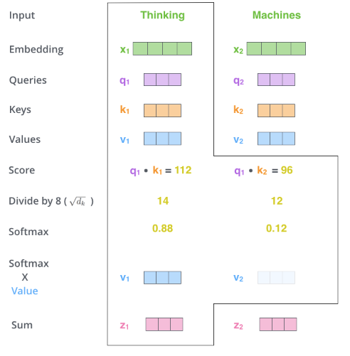
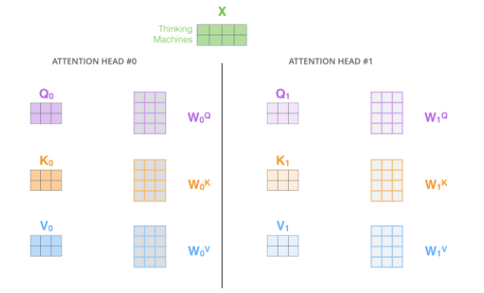
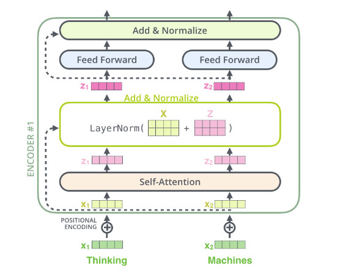
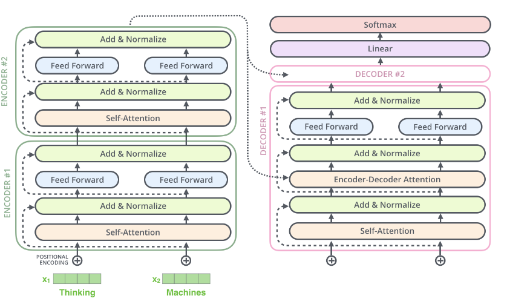

## **Transformers**

Transformer can convert the machine language translation from one language to other.

The transformer model consist of encoders and decoders.
The input sentence is given to encoder, and we get the tranlated sentence after decoder.

- In the encoder block, we have multiple encoder and decoder layers. As in the below image.

- Inside the encoder, we have two layers again one is self-attension layer and other is feed forward neural network which is similar to ANN.
- Self-attension model is very important here.

- The input of sentence is converted to embeddings using word embedding methods like Word2Vec.
- The each word of the sentence will get converted into some fixed dimensions.

As in the above image, the converted vectors are then passed to the self-attension layer.
- The all words of a sentence are passed at same time unlike the RNN, in RNN we pass one word at a time.

## **What are self-attension layers**

Let's see this with an example

The animal didn't cross the street because it was too tired

**Now in the above sentence, what the it is referring to?**

As converting this english sentence to some other language, the model should know this it is refering to animal or street or something else, to convert the sentence properly.

- The below steps are performed first whenever the word is given to the self-attension layer.
- We create 3 weights matrices, and multiply the input vectors with the 3 weight matrices.
- With these multiplications we will get queries, keys, and values matrices.

- The next step is we will create scores by multiplying the queries with keys of all the words, like given in below image.
- This score is calculated with multiplication of queries and keys to find the word is related or not, as we need to find out the word it is referring to what?

- In next step, we will divide the score with the square root of dimensions used.
- And then apply softmax activation function on top of this square root value.
- We will apply the softmax to decide whichever feature has the highest probability values out of 1.

- In the next step, we will multiply the values matrix created above with the softmax score.
- And we will add the multiplication for the words, to get final vector.

- The z1 for word thinking will be the output of self-attension model and z2 will be the output of 2nd word. These outputs then passed as input to Feed Forward Neural Netwrok.

- **If we use the same matrix of Wq, Wk, Wv for all the wordsthen it is called as single-head attension model.**

- And if we use different weights for different words, then it is called as multi-head attension model.
- IF we use single-head attension, we may not capture the reference of word like what the it word is referring to. We may not get accurate result as it will give the highest weightage to one of the word like 'animal' but what if the it word is referring to the 'street' actually.
- For this we have to use multi-head attensions.

- We will get something like given in above image if we use multi-head attension.
- When we use more heads, we will get more z values.
- So we will combine the all the z matrix, and multiply again a new matrix with the concatenated matrix of all z.
- So we will get the final one Z matrix, which is them passed to feed forward neural network.

## **Positional Encoding**

- The ordering of words is very important when it comes to th refernece of any word.
- SO to maintain the order of words, we use positional encodings.
- Which will find the distance between the word embeddings, and create a matrix out of that.
- This positional encodings are placed right after the input embeddings and before passing it to encoders.
- SO the embedding vector and positional embeddings are added to form 'embedding with time signal' vectors.
- And this 'embedding with time signal' vectors are then passed to encoders.

## **Residual Layer**

In residual layer, which is also called as Add & Normalize layer, we can skip the self-attension layer if needed and directly pass the inputs to this layer.

As given in below image.

**The final combined architecture will looks like**

- The output of the encoders layer is connected to every decoder, and in decoder also we have almost same architecture as encoders.
- Threr is additional one layer in decoder as Encoder-Decoder Attension, which takes the input from encoders in all decoders layer.
- As we pass the input of all words at a time, but the output will produces word by word at a time.
- SO the output of first decoder will be passed to the self-attension layer of decoder as input along with the output of encoders, the two outputs of decoders then passed as input to decoders to predict third word, and so on.
- We will apply first linear activation function and then we will perform softmax activation function.

