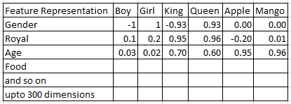
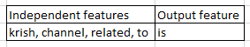
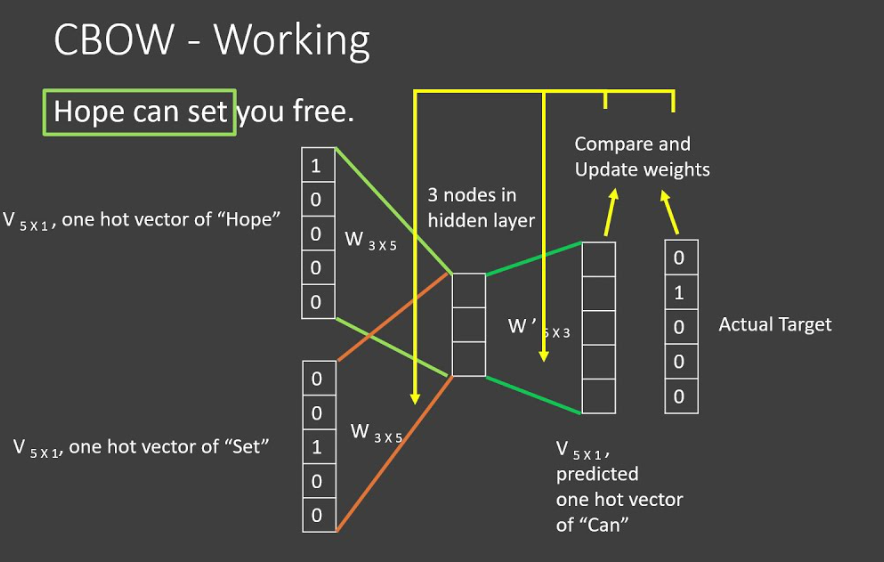
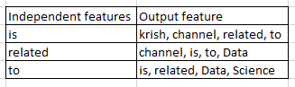

## Word Embeddings

Word embedding is a technique which converts words into vectores.

Word Embeddings is done based on two parts

1) Count or Frequency - BOW, TF-IDF, One Hot Encoding
2) Deep Learning Trained Models - Word2Vec, CBOW, SkipGrams

## Word2Vec

The issues in BOW and TF-IDF are:
1) Semantic meaning is not able to capture means the words which are similar in terms of meaning.
(good, better)
2) Creating the sparse matrix, the dimension is huge and training time is high.

**Word2Vec Explaination**

Word2Vec create a feature representation and find the relationship between the features from feature representation and the input features.

Lets understand this with below example.

- The first column contains all the feature representation on which the already model is trained.
- The row names are the input features from our data.
- The values are the relationship between the input feature and feature representation.
- The gender is totally related to boy and girl but they will be opposite in direction hence one is +ve and other is -ve.
- Similary with others.

The distance or similarity between the vectors can be calculated with the help of cosine similarity.

**Cosine Similarity**

Cosine similarity is used to find out the similarity between the two vectors.

The formula to find cosine similarity is given as,

Distance = 1 - Cosine Similarity

Cos similarity = cos(0)

If the angle between two vectors is 45 degree
then cos 45 = 0.7071

Distance = 1 - 0.7071
Distance = 0.29

**The distance value is more close to 0, means the vectors is more similar and if distance is close to 1, means they are not similary.**

## Continuous Bag of Words (CBOW)

Lets take an example.

We have a sentence as,
[Krish channel is related to Data Science]

- Now first we will decide the window size, we will create the training dataset.
- Now we will take the words with length of window size.

we take here window size = 5
so the first 5 words are [krish, channel, is, related, to]

- The middle word from the above 5 words will be the output feature and rest will be independent features.
- The training data will look like

- Now we will slide the window and do the same process untill we don't get the words of the window size.
- We will always consider the window size as odd number as we have to take independent features of same size, hence the odd number of window will give the equal number of left and right context.  

- Now we will apply the BOW technique to convert the words into vectors using 0 & 1.
- Provide this BOW converted vectors to the ANN, as given in below image.
- We will keep the input layer size as the independent features word size.
- We will keep window size length hidden neurons in hidden layer.
- Use softmax activation function in output layer with no of words in sentence size.
- After calculating loss, we will update the weights and do back propogation.

## SkipGrams

In skip gram the only change is, whatever output features are there in CBOW, that becomes input features in Skip grams.
and whatever the input features in CBOW that becomes output features in Skip grams.

All other ANN training is similar as CBOW.

## AvgWord2Vec

In word2Vec, if we use pre-trained model like google-news-300,
then every word in sentence gets converted into vector of 300 dimension.

So each and every word for each and every sentence in the corpus will get converted into 300 dimension vector.
Hence we will get very huge dimension vector for corpus at the end.

for exa:-
**I eat food**
- Now in the above example using pre-trained google-news-300 model, each word will converted into 300 dimension vector.
- So for one sentence of 3 word, the dimension becomes 900, which is very huge.
- To overcome this issue, we can use AvgWord2Vec.

- In AvgWord2Vec we take the average of vectors for each word for each and every sentence.
- If we consider the same above example, for the whole sentence it will take avg of each word matirx and create once matrix of 300 dimension.
- Hence it will not create very huge dimension matrix instead it will just create sentence wise one matrix of 300 dimension.
- So our model training will be easy and computational light compared to Word2Vec.
