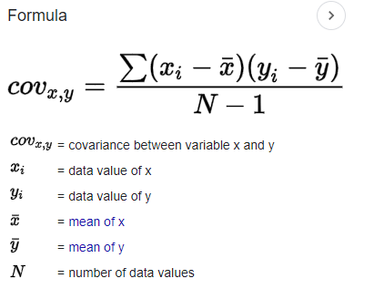

## Covariance

Let's take an example first,

Age(x)|   Weight(y)
12    |    40 
13    |    45
15    |    65
20    |    54
23    |    64

So in the above example, we can say that as age is increasing, weight is also increasing.
And vice-versa, as age is decreasing weight is also decreasing.

Formula:- 

Now this formula is similar to the sample variance formula sum (xi - xbar)^2/n-1

If we tweak covariance formula as,
Cov (x,x) = sum {(xi - xbar) * (xi - xbar)}/n-1
          = sum (xi - xbar)^2/n-1 
          = Variance (x)

**It means Cov(x, x) = Var(x)**

Now for our above example, xbar = 15 & ybar = 51
Based on this Cov(x, y) = 24 i.e +ve value

Conclusions:

**1) The conclusion on +ve cov value is if x increases y also increases & if x decreases y also decreases.**

**2) The conclusion on -ve cov value is if x increases y decreases & if x decreases y increases.**

**3) If cov value is 0 then there is no correlation between x & y**

**4) For correlation there is no value limit that how much +ve value means +ve correlation or vice versa. To restrict this value we use Pearson Correlation Coefficient**

## Pearson Correlation Coefficient (-1 to +1)
We are able to restrict the covariance value just by dividing cov (x, y) with standerd deviations of x & y.

Formula:- 

row (x,y) = {cov(x, y)/(S.D x * S.D y)}

Conclusions:
**1) More the value of Pearson Correlation Coefficient towards +1, the more variables are positively correlated.**

**2) More the value of Pearson Correlation Coefficient towards 11, the more variables are negatively correlated.**

### **Disadvantage**:
1) It holds good only when there is linear data & not for non-linear data.
2) So for Non-linear data we have to use Spearman Rank Correlation

## Spearman Rank Correlation

Formula:

rs = Cov (R(x), R(y))/{S.D (R(x)) * S.D (R(y))}

R(x) & R(y) is just ranking of observations, simply based on x & y values ranks the obersvations as given below.

For calulating this, we uses Rank of variables.
exa:

 x    |    y    |  R(x)   | R(y)
10    |    4    |    4    |  1
8     |    6    |    3    |  2
7     |    8    |    2    |  3
6     |    10   |    1    |  4

**Catch: if there are same observations the same rank will be given**

### **Why this correlation will be used?**

Let's suppose we have three independent features x, y & z and o/p feature.
- Now if there is very strong +ve or -ve relationship between x & o/p feature, then we can say that the x feature important to predict o/p feature.
- Same y feature has very less +ve or -ve relationship between o/p, then we can say that even after dropping y feature, the o/p feature will not be affected.
- Now if x & z feature have very strong relationship then we can drop either of x or z feature, because or more or less they are same.

exa:-  

 Experience  |  Degree  |  City |    predict Salary

- Experience will be +vely correlated with Salary.
- Same City also +vely correlated with Salary.
- Experience and Degree are not might correlated to each other.
- But Degree and Salary can be correlated.
