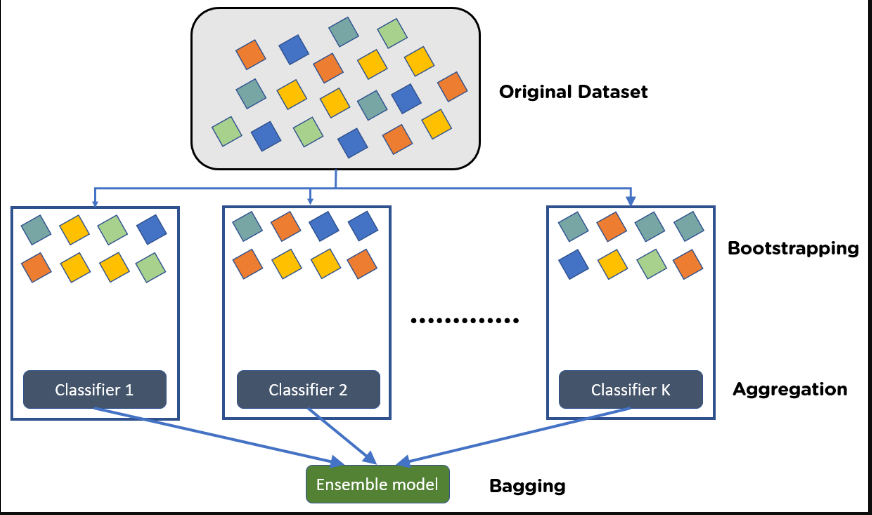
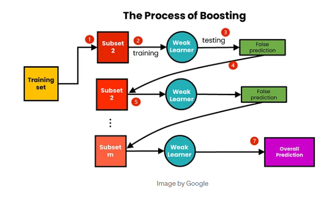

## Bagging & Boosting in Machine Learning (Ensemble Techniques bcoz we combine multiple models)

In Decision tree, if create a decision tree till its complete depth, we know there are many chances of Overfitting. i.e. Low Bias High Variance and to prevent this we use either Pre-Pruning Or Post-Pruning methods.

**Now What is Bagging?**

As shown in the above image, in bagging we train multiple different models parallely and we provide a subset of original dataset to all the models running. And we decide the output of our main model as whatever will be the majority output from all the parallel models.

In Classification we will do the majority of all the outputs of all parallel models and in Regression we will do the aggregate of outputs of all the parallel models.   

So in bagging we use:
- Bootstrap Aggregation:- As the name suggests, we bootstrap the original dataset into multiple datasets and then aggregate the output of all the models.

**Now What is Boosting?**

As shown in above image, We train the models in sequential way and the models used here are Weak learners (Basic model). We combine multiple weak learners so that our model will become a strong learner.
We give output of 1st weak learner to the 2nd weak learner as input, output of 2nd learner to the 3rd weak learner as input and so on.