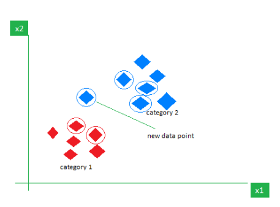

## K-Nearest Neighbour algorithm

This is the distance based algorithm also called as Lazy Learner
because in KNN the algorithm is not learning and creating any equation to predict new data point. KNN just keep all data points and find nearest point using distance approach.

We can use this algorithm for both classification & regression problems.

## 1) KNN for Classification:

In classification as in the above image we have two classes and the new data point will belong to class 1 or class we have to predict that using distance based approach.

So tto solve this we will follow below steps:

- step1: Find distance for each and every point from the new point. For distance we will use euclidean distance method.
- step2: Decide the K value i.e. k nearest neighbour value using hyper paramters.
- step3: based on nearest points classes whichever class has the majority, the new point will belong that particular class.

**While considering the K-value we cannot consider even value for K, as we cannot decide the majority in even data points if the classes are equal. so always take odd numbers for K.**

## 2) KNN for Regression:

In regression we will perform all the above steps similar. just in step3 instead of selecting majority class we will find the mean of the values as the value for new data point.