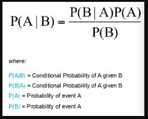

## Naive Bayes Algorithm

Naive Bayes is a probabilistic approach to solve classification problems algorithm.

Like the probability of getting head in 1 coin toss problem is 1/2

So before learning directly the algorithm we need to brush up the probabiliy basics first

**1) Independent Event:-** The event is not get affected by the occurence of other event that event is called as Independent event.
exa:- Tossing a coin two times, so probability of getting head in 1st toss will be same as in 2nd toss
so the 2nd toss is not affecting with the 1st toss so its an independent event.

**2) Dependent Event:-** The event is get affected by the other event then that event is called as Dependent event.
exa:- Drawing the balls from the bag of balls without replacement. Then the 2nd event gets affected with occurence of 1st event as one ball will be decreases after drawing.

**3) Mutually Exclusive:-** The two events which cannot occur at same time that event is called as mutually exclusive event.
exa:- Getting head and tails both on single coin toss.

**4) Conditional Probability:-** The conditional probability is the probability event occurs when previous event is already occured 
P(B/A) i.e. Probability B given A means p(B) when A is already occured.

exa:- Drawing a blue ball out of the bag of balls which contains 2 blue and 4 red balls.
p(blue ball) = 2/6

again drawing a ball which would be blue
p(blue ball) = 1/5

**The equation is given as P(A & B) = P(A) * P(B/A)

## Naive Bayes Formula

## Implementation of bayes theorem on dataset

If we have x1. x2,....,xn independent features
and y will be the dependent feature.

Then, the p(y/x1,x2,...,xn) = p(y) * p(x1,x2,...,xn/y) / p(x1,x2,....,xn)

In this we we can apply naive bayes model on the dataset.

The final output of this classification model will be selected on the basis of normalisation technique.

Like if we have Yes and No classes in dependent variable.

and let's assume,

the p(y/xi) = 0.13
p(n/xi) = 0.05

p(y) = 0.13/0.13+0.05
p(y) = 72%

p(n) = 0.05/0.05+0.13
P(N) = 28%

**so whichever class has the highest probability that class will be the output class.**

