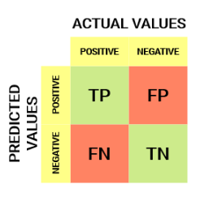

## Classification Performance metrics

There are 5 methods in classification performance metrics
1) Confusion Matrix
2) Accuracy
3) Precision
4) Recall
5) F-Beta score

**1) Confusion Matrix :-** 
we have 2 x 2 matrix as given below,

and we have the predicted and actual y values as:

actual    |   predicted
  0       |      1
  1       |      0
  1       |      1
  0       |      0
  1       |      0

Now in 1st row we have actual as 0 & predicted as 1 so we will update the count in the above matrix

  | 1      |     0      Actual value (y)
----------------------
1 | TP     |     FP
----------------------
0 | FN     |     TN
----------------------

Predicted
Value (y^)

- TP:- True Positive means actual value is Positive i.e. 1 and model predicted correctly i.e. 1
- TN:- True Negative means actual value is negatie i.e. 0 and model predicted correctly i.e. 0
- FP:- False Positive means actual value is negative i.e. 0 but model predicted positive i.e. 1
- FN:- False Negative means the actual value is positive i.e. 1 but model predicted negative i.e. 0

**2) Accuracy:-**
The formula for accuracy is given from the above confusion matrix as,

Accuracy = TP + TN / (TP + TN + FP + FN)

In our example,
accuracy = 1 + 1 / (1 + 1 + 2 + 1)
accuracy = 2/5
accuracy = 0.4 i.e 40%

**Why we cannot rely on accuracy why we need other matrices?**
Let's suppose we have 1000 records out of which 900 records belongs to category 1
and rest 100 records belongs to category 0.
So this type of dataset is called as Imbalanced dataset.

Now we train the model on such imbalanced dataset, then model will give us accuracy like 90% but which is not fair. Hence we cannot just rely on accuracy in such cases. So for this we will require below more matrices. 

**3) Precision:-**
Formula is given as,

Precision = TP / (TP + FP)

  | 1      |     0      Actual value (y)
----------------------
1 | TP     |     FP
----------------------
0 | FN     |     TN
-----------------------

Predicted
Value (y^)

**So this tells us Out of all actual values how many are predicted correctly.**

Practical example:
If we have to classifiy whether the email is Spam or Ham

**If the email is spam but the model has predicted as Not spam then it's okay and it would be a FN situation.
But if the email is not spam but model has predicted as spam it would be a FP situation
So we should always focus on reducing FP**

**Whenever we have to reduce FP then we can use Precision**

**4) Recall:-**

Recall  = TP / (TP + FN)

**Out of all the predicted values how many are correctly predicted**

**Whenever we have to reduce FN then we can use Recall**

**5) F-Beta Score:-**

F-Beta = ((1 + beta^2) * Precision * Recall) / (beta^2 * Precision + Recall)

**Case 1**
If FP & FN both are important then we use Beta = 1,
then it becomes F1 score given as ,

F-1 score = 2 * (Precision * Recall) / (Precision + Recall)

**Case 2**
If FP is more important than FN then Beta  = 0.5
then it becomes F 0.5 Score given as,

F-0.5 Score = ((1 + 0.5^2) * Precision * Recall) / (0.5^2 * Precision + Recall)

**Case 3**
If FN is more important than FP then Beta = 2

F-2 Score = ((1 + 2^2) * Precision * Recall) / (2^2 * Precision + Recall)

