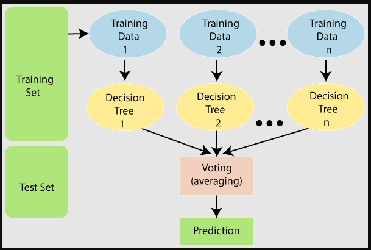

## The Random Forest models are also called as Ensemble Technique as the word Ensemble suggest combine multiple models

Let's take an example

Lets suppose we have d records and m features.

**In sklearn whatever ensemble techniques algorithms are there, we use decision tree models internally.**

So we will combine multiple decision trees parallely in Random Forest model. as [m1, m2, m3, m4,....]

All these decision trees will require some data points to train.
Now to provide the data to each and every, we will perform *"Row Sampling + Feature Sampling with replacement"* randomly as d' and this d' < d.

Now this type of data will send to each and every decision tree and we are doing this with replacement so that some of the data points of model1 can be send to model2 and model3 and so on.

In the end we will take the majority output of all the decision trees and concluded the output of the random forest model.  

## **Why do we need ensemble technique if we use decision tree only?**

So in single decision tree, we face the overfitting issue (low bias & high variance) and to resolve this we use methods called pre-pruning & post-pruning.
But the problem in pre-pruning & post-pruning is that, it is a cumbersome task when we have a very huge dataset.

We can convert high variance to low variance by generalising the model, and in random forest we are exactly doing that we are using multiple decision tree so if one them gets overfitted the other decision trees will get generalise the output.  

## **Out of Bag Evaluation**

Now we are doing row sampling + feature sampling we are confirm that we will be missing on some the data points from original dataset.
So those remaining data points we can use as validation dataset.

So there is a hierarchy in splitting the original data

dataset -> Train & Test
Train -> Train & Validation

Under training dataset, the train data can be used for model training and validation can be used for hyper parameter training. (Cross validation / Grid Search / Random search)

In Random forest we have a parameter called *"OOB_Score"* if this is true the model will select only those data points which are not provided to any of the model while training also called as validation data.

**OOB_Score = Validation Score & OOB_Error = Validation error**
OOB_Error = 1 - OOB_Score

