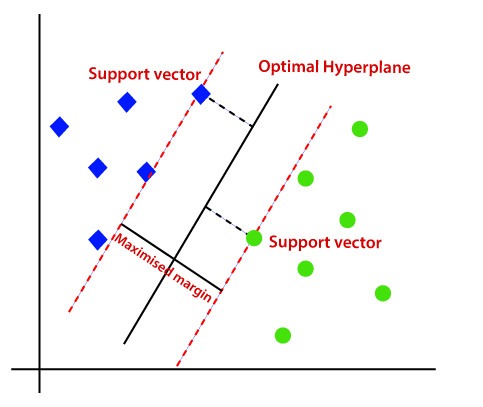
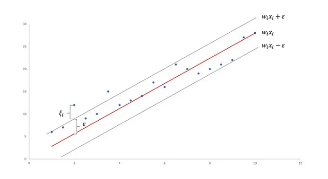

## Support Vector Machine (SVM)

There are two different algorithms for classification & Regression in SVM:
1) Support Vector Classifier (SVC)
2) Support Vector Regressor (SVR)

As we know the equation for staright line is given as ,
y = mx + c
OR
y = B0 + B1x
OR
ax + by + c  = 0

If we find y from above equation it will be,
y = (-a/b)x - c/b
- c/b will be the intercept 
- (-a/b) will be the slope of line.

We can modify the above equation if we have x1 & x2 points instead of x & y:
ax1 + bx2 + c = 0
OR
w1x1 + w2x2 + b = 0

i.e. W^Tx + b = 0
where w^T is the transpose matrix of [w1 w2] which is given as:
[w1
 w2]

Let's assume the line is passing through origin then b = 0 and the equation becomes,
**w^Tx = 0**

IF we have to find out the distance of the point p1 from the plane then it is given by,
where w is the perpendicular to the plane

d = w^T*p1 / ||w||

where
w^T*p1 is the equation of the line
||w|| is the magnitude of w or called as unit vector 

d = w^T*p1 / ||w|| if we expand this equation we will be getting,
d = ||w|| ||p1|| cos0

now we know that w is perpendicular to plane and if any point is above the plane, it will make > 0 angle & < 90 angle

so cos0 = 0 is 0 and cos90 = 1, hence it will be always a +ve value

If the perpendicular vector of coefficients w is facing upwords from the plance
**So whenever the point is above the plane the angle will be > 0 & < 90 hence it will be always a +ve value**
**and when the point is below the plane the angle will be > 90 hence it will be always a -ve value**

**If the perpendicular vector of coefficients w is facing downwards from the plane i.e. in reverse direction of above then,
all the above conclusions will be reversed.**

### **Geometric intution behind SVM**

**1) Support Vector Classifier**

As we classify the data points based on the best fit line in Logistic Regression, we use the same concept here in Support Vector Classifier.

- In SVC, we classifiy the data points whether it's a binary, tertioary or any number of classifier.
- We use best fit line along with the best fit line we find the two marginal lines one marginal line passing through nearest point of one group and other marginal line passing through nearest point of other group, such that the distance between the two marginal line should be maximum.
- and the distance between two marginal lines from the best fit line should be same i.e. they should be at equidistant from the best fit line.

The nearest data points through which the marginal lines are passing are called as Support Vectors.

**In real world problem, it's very rare that the marginal lines are able to clearly seperate the data points and the error will be 0, if it's happen then the marginal lines are called as Hard margin.**

**If the data points are not clearly seperable using the marginal lines and if there are some errors in the best fit line and marginal lines then it is called as Soft Margin**

**Support Vector Classifier Mathematical intution**

Now let's assume we have binary classification data points and we have derived the best fit line with equation, 
w^T*x + b = 0

now our main aim is to find the two marginal lines with the distance between two marginal line should be maximum.
So let's take the marginal line equation passing from the +ve data points would be,
w^T * x1 + b = 1

and marginal line equation passing from -ve data points would be,
w^T * x2 + b = -1

so now let's find the difference between this two marginal line equations,

    w^T * x1 + b = 1
  - w^T * x2 + b = -1
-------------------------
    w^T(x1-x2) = 2

Now in order to take the unit vector of w we will divide the above equation with magnitude of w and the equation becomes,

w^T(x1-x2) =  2
---------- = ---
 ||w||      ||w||

So now our main aim is to maximize the difference between two marginal lines which is also know as Cost function and that difference is,
  2
 ---   by changing the w & b values in equation w^T*x + b
||w||

So for all the correct predicted data points we will make the constraint that,
**{
yi = 1 ,  w^T * xi + b >= 1
yi = -1 , w^T * xi + b <= -1
}**

now if generalise this as,
for all the correct predicted data points,
yi * (w^T * xi + b) >= 1   ....for both -ve & +ve points 

In this above we have written that we have to maximise the cost function 2 / ||w||, but the rule of machine learning algorithms is we have to minimise the cost functions,

so we can write the cost function in such a way that we have to minimise it,

 2                                                   ||w||
----  we have to maximise this means we can minimise -----
||w||                                                  2

So the final cost function will be given as,

||w|| + Ci sum (zeta)   where Ci sum (zeta) is the hinge loss.
-----
  2
  
Ci = how many points we can ignore for miss classification (hyperparameter)
so basic idea of Ci is the count the data points which will come in soft margin that are being errors we have to ignore those data points.

Zeta = distance of incorrect data points from the marginal planes.

Ci sum (zeta) this is the hyperparameter terms and in this we will count the incorrect data points within the two marginal planes and then take the sum of the distance of that incorrect classified data point from the respective marginal plane.

### **2) Support Vector Regressor**

 as given in this image, we have the best fit line and the marginal lines

If the equation of best fit line is given as,  

y = W^T * x + b

Then the equation of marginal line towards the +ve data point is given as,

y = W^T * x + b + E (E = epsilong i.e. marginal error which means this much error is acceptable.)

Similarly, the equation of marginal line towards the -ve data point is given as,

y = W^T * x + b - E

The cost function is given as,

Cost function = ||w||
                ------  + Ci sum (zeta i) => Hinge loss
                  2

Constraint would be,

|yi - wixi| <= |Epselong + Zeta|

|yi - wixi| => the difference between the actual & predicted data point.

so the constraint is saying that of the difference between the actual & predicted data point <= the E (epselong i.e. distance between the best fit line & marginal line) + (zeta i.e. distance between data point & marginal line) then our performed model i.e. best fit line & marginal lines are performing well.

### **Interview questions**

1) will SVM get impacted by outliers - Yes because we consider the distance between the points and wherever we are taking distance outliers will impact the model.

2) Do we need to perform scaling?
Yes we need to scale data in one scale.
