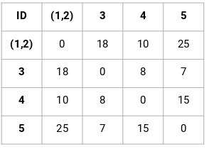

## Hirarchical Clustering

As the name suggests, we create a hirarchy of clusters in this algorithm.
Hirarchy of clusters means the various levels of clusters like we use top down approach in filters.

exa:- 
Let's take an example of a college, the college is one cluster.

Now we can further divide this cluster into streams of colleges as Computer, mech, civial, etc.
Now in further streams we can create clusters for boys and girls

So we have created 3 different levels of cluster from 1 cluster and this is called as hirarchy so it is called as hirarchical clustering.

## How do we decide the clusters in hierarchical clustering

Let's take the above example

The above is the point matrix of the above example where we have find out the distances of all points from each other.

- Now merge the points who has the lowest distance. Here in our problem point 1 & 2 has the lowest distance so we will merge both the points 

so the updated points will looks like. Here we have taken the max from point 1 and 2 but we can take minimum or average as well.

This is the updated distance matrix after combining the two points.

So repeat this all steps until only a single cluster is left.

Atlast this kind of clusters will be formed and the dendogram for above clusters will look like

## Dendogram

Dendogram is a representation of hirarchical clustering.

In creating dendogram there are two approaches:

1) Agglomerative: 
- Where each point is cluster.
- Bottom top approach
- Combining all the points as a single cluster.

2) Divisive:
- Where all points is one cluster.
- Top bottom approach
- dividing all the points into seperate clusters.

## DBSCAN (Density based spatial clustering with application with noise)

If we have densed data points then we cannot use k-means of hierarchical clustering.
for this type of dataset we would require new algorithm to perform which is also called as density based approach.

In DBSCAN approach there are 5 points to be consider mainly.

This points are also called as hyperparameters of DBSCAN

1) Epsilon distance
2) Core point
3) Border point
4) Noise point
5) Minimum point

Let's learn how this above 5 points are important in creating a cluster.

- Now with the help of epsilon distance, we create a circle of radius = epsilon distance by taking any point randomly as the center point
- Now inside that created circle, there must be minimum points inside the circle. If the minimum point condition is satisfied with that random point then we can call it as a core point.
- If we create a circle from one points and if that point is not satfifying the minimum point condition then we will call that point as boundry point but it must be neighbour of core point.
- and if it's not neighbour of core point then it is called as noise point.

