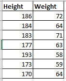

## K-Means Algorithm

In Unsupervised machine learning algorithms, we create clusters of similar data points based on the distance between the data points.

The distance is calculated by the euclidian distance method.

The formula for euclidian distance is given as,

distance = sqrt((x2 - x1)2 + (y2 - y1)2)

## K-Means clustering intution

Here K in the name of K-means itself is used for number of centroids i.e. around the centroid we will build the clusters
and that number of centroids are defined by the elbow method.

Let's consider the above dataset and we will try to solve this problem using K-Means clustering.

- step1: Find out the centroids. Initially set centroids randomly. Here we will select 2 centroids randomly as first 2 data points.

So first centroid is (186, 72) & second centroid is (184, 64)

- step2: Find the distance from both centroids and the remaining data points using euclidian distance method.
d(c1, 3rd point) & d(c2, 3rd point)

The 3rd data point is (183, 71)
d(c1, 3rd point) = 3.16
d(c2, 3rd point) = 7.07

Now the distance of 3rd data point & centroid 1 is less than ccentroid 2.
hence we will consider 3rd point belong to centroid 1.

From whichever centroid the distance is less to the data point, that data point will belong to that centroid/cluster.

- step3: Now after adding any further point to centroid, we will update the centroid.
the centroid1 = (186, 72)
the 3rd point added to centroid 1 = (183, 71)

the updated centroid1 = 186+183/2 , 72+71/2
the updated centroid1 = (184.5 , 71.5)

so the updated centroid1 will be (184.5 , 71.5)

- step4: repeat the all the steps till step3 with all the data points and update the centroids and create full clusters.

## Elbow method which is used to decide the no of clusters

- WCSS - Within Cluster Sum of Squares.
- Intraluster distance - The distance between the points and centroid of the same cluster. (within same cluster)
- Intercluster distance - The distance between the data points of other cluster and centroid of other cluster (different cluster)

Now for different K values we will calculate the WCSS, and it is given by formula
WCSS = sum(d(c, xi)^2)

Now let's take the secnarios,

- if K=1, WCSS will be much higher as all the data points will be considered only in single cluster the data points will be much scattered so the distance will also be high.

- if K=2, WCSS will be lower as compare to K=1, as the data points will be seperated as per the nearer cluster hence the distance will get reduced. will take the avg of WCSS of both clusters

- If k=3, the WCSS for this is again smaller than K=2, again the avg of WCSS of 3 clusters

WCSS1 > WCSS2 > WCSS3

.png>)

As given in the above image, we will select the K-value where the WCSS will not change anymore further.

## Validation / Evaluation of clusters

1) Dunn Indexing
2) Silhoute Score

1) Dunn Indexing: max( d(xi, xj)) / max( d(yi, yj))

2) Silhoute Score: bi - ai / max(bi-ai) 
The range of this score is [-1 to 1]

Where ai = Intracluster distance
bi = Intercluster distance

The more +ve value towards 1, the clusters are good in accuracy.