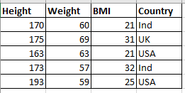

## Difference between supervised & Unsupervised Machine learning

In Supervised ML we have given the target column, and we have to predict that target column whether it is classification or regression.

The BMI column is the target column which we can predict based on height & weight.

In Unsupervised ML we have to group the data, we cannot predict it based on any target column.
We do clustering in this kind of problems.

In this we cannot predict country column, instead we can group or cluster data based on country column.

